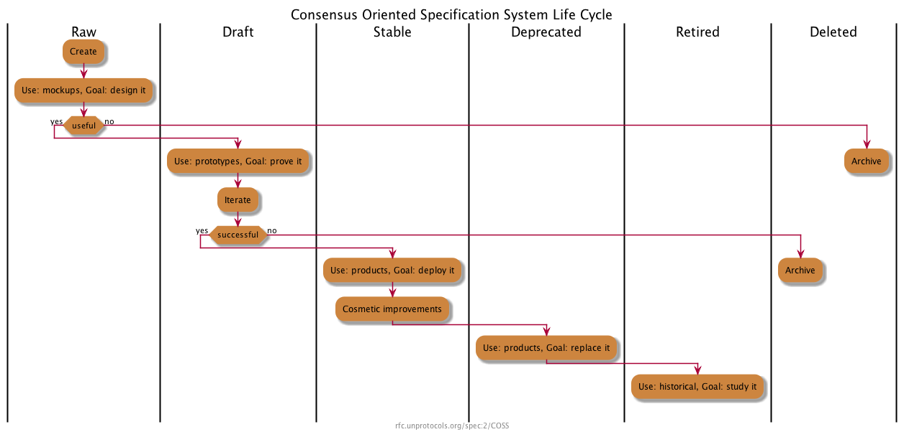

This document describes a consensus-oriented specification system (COSS) for building interoperable technical specifications.
COSS is based on a lightweight editorial process that seeks to engage the widest possible range of interested parties and move rapidly to consensus through working code.

This specification is based on [Unprotocols 2/COSS](https://github.com/unprotocols/rfc/blob/master/2/README.md), used by the [ZeromMQ](https://rfc.zeromq.org/) project.
It is equivalent except for some areas:

- recommending the use of a permissive licenses, such as CC0 (with the exception of this document);
- miscellaneous metadata, editor, and format/link updates;
- more inheritance from the [IETF Standards Process](https://www.rfc-editor.org/rfc/rfc2026.txt),
  e.g. using RFC categories: Standards Track, Informational, and Best Common Practice;
- standards track specifications SHOULD follow a specific structure that both streamlines editing,
  and helps implementers to quickly comprehend the specification
- specifications MUST feature a header providing specific meta information

## License

Copyright (c) 2008-22 the Editor and Contributors.

This Specification is free software;
you can redistribute it and/or modify it under the terms of the GNU General Public License as published by the Free Software Foundation;
either version 3 of the License, or (at your option) any later version.

This Specification is distributed in the hope that it will be useful, but WITHOUT ANY WARRANTY;
without even the implied warranty of MERCHANTABILITY or FITNESS FOR A PARTICULAR PURPOSE.
See the GNU General Public License for more details.

You should have received a copy of the GNU General Public License along with this program;
if not, see http://www.gnu.org/licenses.

## Change Process

This document is governed by the [1/COSS](spec/1) (COSS).

## Language

The key words "MUST", "MUST NOT", "REQUIRED", "SHALL", "SHALL NOT", "SHOULD", "SHOULD NOT", "RECOMMENDED",  "MAY", and "OPTIONAL" in this document are to be interpreted as described in
[RFC 2119](http://tools.ietf.org/html/rfc2119).

## Goals

The primary goal of COSS is to facilitate the process of writing, proving, and improving new technical specifications.
A "technical specification" defines a protocol, a process, an API, a use of language, a methodology,
or any other aspect of a technical environment that can usefully be documented for the purposes of technical or social interoperability.

COSS is intended to above all be economical and rapid, so that it is useful to small teams with little time to spend on more formal processes.

Principles:

* We aim for rough consensus and running code; [inspired by the IETF Tao](https://www.ietf.org/about/participate/tao/).
* Specifications are small pieces, made by small teams.
* Specifications should have a clearly responsible editor.
* The process should be visible, objective, and accessible to anyone.
* The process should clearly separate experiments from solutions.
* The process should allow deprecation of old specifications.

Specifications should take minutes to explain, hours to design, days to write, weeks to prove, months to become mature, and years to replace.

Specifications have no special status except that accorded by the community.

## Architecture

COSS is designed around fast, easy to use communications tools.
Primarily, COSS uses a wiki model for editing and publishing specifications texts.

* The *domain* is the conservancy for a set of specifications in a certain area.
* Each domain is implemented as an Internet domain, hosting a wiki and optionally other communications tools.
* Each specification is a set of wiki pages, together with comments, attached files, and other resources.
* Important specifications may also exist as subdomains, i.e. child wikis.

Individuals can become members of the domain by completing the necessary legal clearance.
The copyright, patent, and trademark policies of the domain must be clarified in an Intellectual Property policy that applies to the domain.

Specifications exist as multiple pages, one page per version of the specification (see "Branching and Merging", below), which may be assigned URIs that include an incremental number.
Thus, we refer to a specification by specifying its domain, number, and short name.
New versions of the same specification will have new numbers.
The syntax for a specification reference is:

    <domain>/spec/<number>/<shortname>

For example, this specification is **rfc.vac.dev/spec/1/COSS**.
The short form **1/COSS** may be used when referring to the specification from other specifications in the same domain.

Every specification (including branches) carries a different number.

## COSS Lifecycle

Every specification has an independent lifecycle that documents clearly its current status.

A specification has six possible states that reflect its maturity and contractual weight:

### Raw Specifications

All new specifications are **raw** specifications.
Changes to raw specifications can be unilateral and arbitrary.
Those seeking to implement a raw specification should ask for it to be made a draft specification.
Raw specifications have no contractual weight.

### Draft Specifications

When raw specifications can be demonstrated, they become **draft** specifications.
Changes to draft specifications should be done in consultation with users.
Draft specifications are contracts between the editors and implementers.

### Stable Specifications

When draft specifications are used by third parties, they become **stable** specifications.
Changes to stable specifications should be restricted to cosmetic ones, errata and clarifications.
Stable specifications are contracts between editors, implementers, and end-users.

### Deprecated Specifications

When stable specifications are replaced by newer draft specifications, they become **deprecated** specifications.
Deprecated specifications should not be changed except to indicate their replacements, if any.
Deprecated specifications are contracts between editors, implementers and end-users.

### Retired Specifications

When deprecated specifications are no longer used in products, they become **retired** specifications.
Retired specifications are part of the historical record.
They should not be changed except to indicate their replacements, if any.
Retired specifications have no contractual weight.

### Deleted Specifications

Deleted specifications are those that have not reached maturity (stable) and were discarded.
They should not be used and are only kept for their historical value.
Only Raw and Draft specifications can be deleted.

## Editorial control

A specification MUST have a single responsible editor,
the only person who SHALL change the status of the specification through the lifecycle stages.

A specification MAY also have additional contributors who contribute changes to it.

If the resposible editor is no longer active, the editor MUST be replaced by an new editor.

It is RECOMMENDED to use a process similar to [C4 process](https://github.com/unprotocols/rfc/blob/master/1/README.md)
to maximize the scale and diversity of contributions.

Unlike the original C4 process however, it is RECOMMENDED to use CC0 as a more permissive license alternative.
We SHOULD NOT use GPL or GPL-like license.
One exception is this specification, as this was the original license for this specification.

The editor is responsible for accurately maintaining the state of specifications and for handling all comments on the specification.

## Branching and Merging

Any member of the domain MAY branch a specification at any point.
This is done by copying the existing text, and creating a new specification with the same name and content, but a new number.
The ability to branch a specification is necessary in these circumstances:

* To change the responsible editor for a specification, with or without the cooperation of the current responsible editor.
* To rejuvenate a specification that is stable but needs functional changes.
  This is the proper way to make a new version of a specification that is in stable or deprecated status.
* To resolve disputes between different technical opinions.

The responsible editor of a branched specification is the person who makes the branch.

Branches, including added contributions, are derived works and thus licensed under the same terms as the original specification.
This means that contributors are guaranteed the right to merge changes made in branches back into their original specifications.

Technically speaking, a branch is a *different* specification, even if it carries the same name.
Branches have no special status except that accorded by the community.

## Conflict resolution

COSS resolves natural conflicts between teams and vendors by allowing anyone to define a new specification.
There is no editorial control process except that practised by the editor of a new specification.
The administrators of a domain (moderators) may choose to interfere in editorial conflicts,
and may suspend or ban individuals for behaviour they consider inappropriate.

## Specification Structure

### Meta Information

Specifications MUST contain the following metadata.
It is RECOMMENDED that specification metadata is specified as a YAML header (where possible).
This will enable programmatic access to specification metadata.

| Key              | Value                | Type   | Example                                                                                                                                                                                                                             |
|------------------|----------------------|--------|-------------------------------------------------------------------------------------------------------------------------------------------------------------------------------------------------------------------------------------|
| **shortname**    | short name           | string | 1/COSS                                                                                                                                                                                                                              |
| **title**        | full name            | string | Consensus-Oriented Specification System                                                                                                                                                                                             |
| **status**       | status               | string | draft                                                                                                                                                                                                                               |
| **category**     | category             | string | Best Current Practice                                                                                                                                                                                                                            |
| **tags**         | 0 or several tags    | list   | waku-application, waku-core-protocol                                                                                                                                                                                                |
| **editor**       | editor name/email    | string | Oskar Thoren <oskar@status.im>                                                                                                                                                                                                      |
| **contributors** | contributors         | list   | - Pieter Hintjens <ph@imatix.com>  - André Rebentisch <andre@openstandards.de>  - Alberto Barrionuevo <abarrio@opentia.es>  - Chris Puttick <chris.puttick@thehumanjourney.net>  - Yurii Rashkovskii <yrashk@gmail.com> |

### Specification Template

Standards Track specifications SHOULD be based on the [Vac RFC template](https://github.com/vacp2p/rfc/blob/master/content/docs/rfcs/template/README.md).

## Conventions

Where possible editors and contributors are encouraged to:

* Refer to and build on existing work when possible, especially IETF specifications.
* Contribute to existing specifications rather than reinvent their own.
* Use collaborative branching and merging as a tool for experimentation.
* Use Semantic Line Breaks: https://sembr.org/.

## Appendix A. Color Coding

It is RECOMMENDED to use color coding to indicate specification's status. Color coded specifications SHOULD use the following color scheme:

* 
* 
* 
* 
* 
* 
