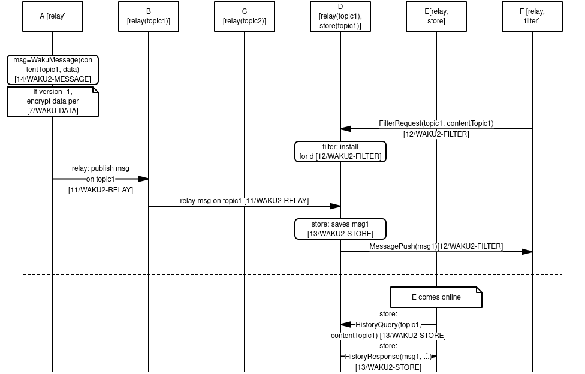

## Abstract

Waku v2 is a family of modular peer-to-peer protocols for secure communication.
These protocols are designed to be secure, privacy-preserving, 
censorship-resistant and run in resource-restricted environments.
At a high level, it implements a publish/subscribe, PubSub, 
messaging mechanism over [libp2p](https://github.com/libp2p/specs) and adds capabilities.

These capabilities are things such as:
- Retrieving historical messages for mostly-offline devices.
- Adaptive nodes, allowing for heterogeneous nodes to contribute to the network.
- Preserving bandwidth usage for resource-restriced devices.

This makes Waku v2 ideal for running a p2p protocol on mobile devices and other similar restricted environments.

Historically, it has its roots in [Waku v1](/spec/6),
which stems from [Whisper](https://eips.ethereum.org/EIPS/eip-627), originally part of the Ethereum stack.
However, Waku v2 acts more as a thin wrapper for PubSub and has a different API.
It is implemented in an iterative manner where initial focus is on porting essential functionality to libp2p.
See [rough road map (2020)](https://vac.dev/waku-v2-plan) for more historical context.

## Motivation and Goals

Waku as a family of protocols is designed to have a set of properties that are useful for many applications:

1. **Useful for generalized messaging.**

Many applications require some form of messaging protocol to communicate between different subsystems or different nodes.
This messaging can be human-to-human, machine-to-machine or a mix.
Waku is designed to work for all these scenarios.

2. **Peer-to-peer.**

Applications sometimes have requirements that make them suitable for peer-to-peer solutions:
- Censorship-resistant with no single point of failure 
- Adaptive and scalable network
- Shared infrastructure

3. **Runs anywhere.**

Applications often run in restricted environments, where resources or the environment is restricted in some fashion.
For example:

- Limited bandwidth, CPU, memory, disk, battery, etc
- Not being publicly connectable
- Only being intermittently connected; mostly-offline

4. **Privacy-preserving.**

 Applications often have a desire for some privacy guarantees, such as:
 - Pseudonymity and not being tied to any personally identifiable information (PII)
 - Metadata protection in transit
 - Various forms of unlinkability, etc

5. **Modular design.**

Applications often have different trade-offs when it comes to what properties they and their users value.
Waku is designed in a modular fashion where an application protocol or node can choose what protocols they run.
We call this concept *adaptive nodes*.

For example:
- Resource usage vs metadata protection
- Providing useful services to the network vs mostly using it
- Stronger guarantees for spam protection vs economic registration cost

For more on the concept of adaptive nodes and what this means in practice,
please see the [30/ADAPTIVE-NODES](/spec/30) spec.

## Network Interaction Domains
The key words “MUST”, “MUST NOT”, “REQUIRED”, “SHALL”, “SHALL NOT”, “SHOULD”, “SHOULD NOT”, “RECOMMENDED”, “NOT RECOMMENDED”, 
“MAY”, and “OPTIONAL” in this document are to be interpreted as described in [RFC 2119](https://www.ietf.org/rfc/rfc2119.txt).

While Waku v2 is best thought of as a single cohesive thing, there are three network interaction domains:

(a) gossip domain
(b) discovery domain
(c) request/reply domain

### Protocols and identifiers

Since Waku v2 is built on top of libp2p, many protocols have a libp2p protocol identifier.
The current main [protocol identifiers](https://docs.libp2p.io/concepts/protocols/) are:

1. `/vac/waku/relay/2.0.0`
2. `/vac/waku/store/2.0.0-beta4`
3. `/vac/waku/filter/2.0.0-beta1`
4. `/vac/waku/lightpush/2.0.0-beta1`

This is in addition to protocols that specify messages, payloads, and RECOMMENDED usages.
Since these aren't negotiated libp2p protocols, they are referred to by their RFC ID.
For example:

- [14/WAKU2-MESSAGE](/spec/14) and [26/WAKU2-PAYLOAD](/spec/26) for message payloads
- [23/WAKU2-TOPICS](/spec/23) and [27/WAKU2-PEERS](/spec/27) for recommendations around usage

There are also more experimental libp2p protocols such as:

1. `/vac/waku/swap/2.0.0-beta1`
2. `/vac/waku/waku-rln-relay/2.0.0-alpha1`

These protocols and their semantics are elaborated on in their own specifications.


### Use of libp2p and protobuf

Unless otherwise specified, all protocols are implemented over libp2p and use Protobuf by default.
Since messages are exchanged over a [bi-directional binary stream](https://docs.libp2p.io/concepts/protocols/),
as a convention, libp2p protocols prefix binary message payloads with the length of the message in bytes.
This length integer is encoded as a [protobuf varint](https://developers.google.com/protocol-buffers/docs/encoding#varints).

### Gossip domain

Waku is using gossiping to disseminate messages throughout the network.

**Protocol identifier***: `/vac/waku/relay/2.0.0`

See [11/WAKU2-RELAY](/spec/11) spec for more details.

For an experimental privacy-preserving economic spam protection mechanism, see [17/WAKU2-RLN-RELAY](/spec/17).

See [23/WAKU2-TOPICS](/spec/23) for more information about the RECOMMENDED topic usage.

### Direct use of libp2p protocols

In addition to `/vac/waku/*` protocols, Waku v2 MAY directly use the following libp2p protocols:

* [libp2p ping protocol](https://docs.libp2p.io/concepts/protocols/#ping) with protocol id

```
/ipfs/ping/1.0.0
```

For liveness checks between peers, or to keep peer-to-peer connections alive.

* [libp2p identity and identity/push](https://docs.libp2p.io/concepts/protocols/#identify) with protocol IDs

```
/ipfs/id/1.0.0

```

and

```
/ipfs/id/push/1.0.0
```

Respectively, as basic means for capability discovery.
These protocols are anyway used by the libp2p connection establishment layer Waku v2 is built on.
We plan to introduce a new Vac capability discovery protocol with better anonymity properties and 
more functionality.

### Transports

Waku v2 is built on top of libp2p, and like libp2p, it strives to be transport agnostic.
We define a set of RECOMMENDED transports in order to achieve a baseline of interoperability between clients.

Waku v2 node implementations SHOULD support the TCP transport.

Where TCP is supported, it MUST be enabled for both dialing and listening, 
even if other transports are available.

Waku v2 nodes, whose environment do not allow use of TCP directly, 
MAY use other transports. 

A Waku v2 node SHOULD support secure websockets for bidirectional communication streams, 
for example in a web browser context.

A node MAY support unsecure websockets if required by the application or running environment.

### Discovery domain

#### Discovery methods

Waku v2 can retrieve a list of nodes to connect to using DNS-based discovery as per [EIP-1459](https://eips.ethereum.org/EIPS/eip-1459).
While this is a useful way of bootstrapping connection to a set of peers,
it MAY be used in conjunction with an 
[ambient peer discovery](https://docs.libp2p.io/concepts/publish-subscribe/#discovery) procedure to find still other nodes to connect to,
such as [Node Discovery v5](https://github.com/ethereum/devp2p/blob/8fd5f7e1c1ec496a9d8dc1640a8548b8a8b5986b/discv5/discv5.md).
More ambient peer discovery methods are being tested for Waku v2,
and will be specified for wider adoption.
A ambient peer discovery method used by Waku v2 is described in [33/WAKU2-DISCV5](/spec/33).
A Waku v2 node MAY bypass the discovery domain by specifying static nodes.

#### Use of ENR

[31/WAKU2-ENR](/spec/31) describes the usage of [EIP-778 ENR (Ethereum Node Records)](https://eips.ethereum.org/EIPS/eip-778) for Waku v2 discovery purposes.
It introduces two new ENR fields, `multiaddrs` and `waku2`, 
that a Waku v2 node MAY use for discovery purposes.
These fields MUST be used under certain conditions, as set out in the specification.
Both EIP-1459 DNS-based discovery and Node Discovery v5 operates on ENR,
and it's reasonable to expect even wider utility for ENR in Waku v2 networks in future.

### Request/Reply domain

In addition to the Gossip domain,
Waku v2 provides a set of Request/Reply protocols.
They are primarily used in order to get Waku v2 to run in resource restricted environments,
such as low bandwidth or being mostly offline.

#### Historical message support

**Protocol identifier***: `/vac/waku/store/2.0.0-beta4`

This is used to fetch historical messages for mostly offline devices.
See [13/WAKU2-STORE](/spec/13) specifiction for more details.

An experimental fault-tolerant addition to the store protocol, 
as described in [21/WAKU2-FT-STORE](/spec/21), relaxes the high availability requirement.

#### Content filtering

**Protocol identifier***: `/vac/waku/filter/2.0.0-beta1`

This is used to make fetching of a subset of messages more bandwidth preserving.
See [12/WAKU2-FILTER](/spec/12) specification for more details.

#### Light push

**Protocol identifier***: `/vac/waku/lightpush/2.0.0-beta1`

This is used for nodes with short connection windows and 
limited bandwidth to publish messages to the Waku network.
See [19/WAKU2-LIGHTPUSH](/spec/19) specification for more details.

#### Other protocols

The above is a non-exhaustive list, and 
due to the modular design of Waku v2 there may be other protocols here that provide a useful service to the Waku network.

### Overview of protocol interaction

See the sequence diagram below for an overview of how different protocols interact.



We have six nodes, A-F.
The protocols initially mounted are indicated as such.
The PubSub topics `pubTopic1` and `pubsubTopic2` is used for routing and
indicates that it is subscribed to messages on that topic for relay,
see [11/WAKU2-RELAY](/spec/11) for details.
Ditto for [13/WAKU2-STORE](/spec/13),
where it indicates that these messages are persisted on that node.

1. Node A creates a `WakuMessage` `msg1` with a ContentTopic `contentTopic1`.
See [14/WAKU2-MESSAGE](/spec/14) for more details.
If `WakuMessage` `version` is set to 1,
we use the [6/WAKU1](/spec/6) compatible `data` field with encryption.
See [7/WAKU-DATA](/spec/7) for more details.

2. Node F requests to get messages filtered by PubSub topic `pubTopic1` and
ContentTopic `contentTopic1`.
Node D subscribes F to this filter and, in the future,
will forward messages that match this filter.
See [12/WAKU2-FILTER](/spec/12) for more details.

3. Node A publishes `msg1` on `pubTopic1` and
subscribes to that pubsub topic so relay node B can receive it.
It then gets relayed further from B to D, but
not C since it doesn't subscribe to that pubsub topic.
See [11/WAKU2-RELAY](/spec/11).

4. Node D saves `msg1` for possible later retrieval by other nodes.
See [13/WAKU2-STORE](/spec/13).

5. Node D also pushes `msg1` to F, as it has previously subscribed F to this filter.
See [12/WAKU2-FILTER](/spec/12).

6. At a later time, Node E comes online.
It then requests messages matching `pubtopic1` and `contentTopic1` from Node D.
Node D responds with messages meeting this (and possibly other) criteria.
See [13/WAKU2-STORE](/spec/13).

### Appendix A: Upgradability and Compatibility

#### Compatibility with Waku v1

Waku v1 and Waku v2 are different protocols all together.
They use a different transport protocol underneath; 
Waku v1 is devp2p RLPx based while Waku v2 uses libp2p.
The protocols themselves also differ as does their data format.
Compatibility can be achieved only by using a bridge that not only talks both devp2p RLPx and libp2p, but 
that also transfers (partially) the content of a packet from one version to the other.

See [15/WAKU-BRIDGE](/spec/15) for details on a bidirectional bridge mode.

### Appendix B: Security 

Each protocol layer of Waku v2 provides a distinct service and 
is associated with a separate set of security features and concerns.
Therefore, the overall security of Waku v2 depends on how the different layers are utilized.
In this section, we overview the security properties of Waku v2 protocols against a static adversarial model,
which is described below.
Note that a more detailed security analysis of each Waku v2 protocol is supplied in its respective specification as well.

#### Primary Adversarial Model

In the primary adversarial model, 
we consider adversary as a passive entity that attempts to collect information from others to conduct an attack,
but it does so without violating protocol definitions and instructions.

The following are **not** considered as part of the adversarial model: 
  -  An adversary with a global view of all the peers and their connections. 
  -  An adversary that can eavesdrop on communication links between arbitrary pairs of peers
  (unless the adversary is one end of the communication).
  Specifically, the communication channels are assumed to be secure.

#### Security Features

##### Pseudonymity 

Waku v2, by default, guarantees pseudonymity for all of the protocol layers since parties do not have to disclose their true identity and 
instead they utilize libp2p `PeerID` as their identifiers.
While pseudonymity is an appealing security feature, 
it does not guarantee full anonymity since the actions taken under the same pseudonym i.e., 
`PeerID` can be linked together and potentially result in the re-identification of the true actor. 
  
##### Anonymity / Unlinkability

At a high level, anonymity is the inability of an adversary in linking an actor to its data/performed action 
(the actor and action are context-dependent).
To be precise about linkability, we use the term,
Personally Identifiable Information (PII) refers to any piece of data that could potentially be used to uniquely identify a party.
For example, the signature verification key, and 
the hash of one's static IP address are unique for each user and hence count as PII.
Notice that users' actions can be traced through their PIIs 
(e.g., signatures) and hence result in their re-identification risk.
As such, we seek anonymity by avoiding linkability between actions and 
the actors / actors' PII. 
Concerning anonymity, Waku v2 provides the following features:

**Publisher-Message Unlinkability**:
This feature signifies the unlinkability of a publisher to its published messages in the [11/WAKU2-RELAY](/spec/11) protocol.
The [Publisher-Message Unlinkability](/spec/11#security-analysis) is enforced through the `StrictNoSign` policy,
due to the data fields of pubsub messages that count as PII for the publisher must be left unspecified.

**Subscriber-Topic Unlinkability**:
This feature stands for the unlinkability of the subscriber to its subscribed topics in the [11/WAKU2-RELAY](/spec/11) protocol.
The [Subscriber-Topic Unlinkability](/spec/11/#security-analysis) is achieved through the utilization of a single PubSub topic.
As such, subscribers are not re-identifiable from their subscribed topic IDs (`pubsub_topic`) as the entire network is linked to the same topic ID (`pubsub_topic`).
This level of unlinkability / anonymity is known as [k-anonymity](https://www.privitar.com/blog/k-anonymity-an-introduction/),
where k is proportional to the system size (number of subscribers).
Note that there is no hard limit on the number of the pubsub topics, however, 
the use of one pubsub topic is RECOMMENDED for the sake of anonymity. 

##### Spam protection

This property indicates that no adversary can flood the system 
(i.e., publishing a large number of messages in a short amount of time), 
either accidentally or deliberately, with any kind of message i.e. even if the message content is valid or useful.
Spam protection is partly provided in `11/WAKU2-RELAY` through the 
[scoring mechanism](https://github.com/libp2p/specs/blob/master/pubsub/gossipsub/gossipsub-v1.1.md#spam-protection-measures) provided for by GossipSub v1.1.
At a high level, peers utilize a scoring function to locally score the behavior of their connections and 
remove peers with a low score.
  
##### Data confidentiality, Integrity, and Authenticity

Confidentiality can be addressed through data encryption whereas integrity and 
authenticity are achievable through digital signatures.
These features are provided for in [14/WAKU2-MESSAGE (version 1)](/spec/14#version-1)` through payload encryption as well as encrypted signatures.

## Security Considerations

**Lack of anonymity/unlinkability in the protocols involving direct connections including `13/WAKU2-STORE` and `12/WAKU2-FILTER` protocols**:
The anonymity/unlinkability is not guaranteed in the protocols like `13/WAKU2-STORE` and 
`12/WAKU2-FILTER` where peers need to have direct connections to benefit from the designated service.
This is because during the direct connections peers utilize `PeerID` to identify each other,
therefore the service obtained in the protocol is linkable to the beneficiary's `PeerID` (which counts as PII).
For `13/WAKU2-STORE`, the queried node would be able to link the querying node's `PeerID` to its queried topics(`contentTopic`).
Likewise, in the `12/WAKU2-FILTER`, a full node can link the light node's `PeerID`s to its content filter.

### Appendix C: Implementation Notes

#### Implementation Matrix

There are multiple implementations of Waku v2 and its protocols:

- [nim-waku (Nim)](https://github.com/status-im/nim-waku/)
- [go-waku (Go)](https://github.com/status-im/go-waku/)
- [js-waku (NodeJS and Browser)](https://github.com/status-im/js-waku/)

In the following overview, you can find the implemented specifcations utilizing Waku v2.
This includes Waku v1 specifications, as they are used for bridging between the two networks.

| Spec | nim-waku (Nim) | go-waku (Go) | js-waku (Node JS) | js-waku (Browser JS) |
| ---- | -------------- | ------------ | ----------------- | -------------------- |
|[6/WAKU1](/spec/6)|✔|||
|[7/WAKU-DATA](/spec/7)|✔|✔||
|[8/WAKU-MAIL](/spec/8)|✔|||
|[9/WAKU-RPC](/spec/9)|✔|||
|[10/WAKU2](/spec/10)|✔|🚧|🚧|🚧|
|[11/WAKU2-RELAY](/spec/11)|✔|✔|✔|✔|
|[12/WAKU2-FILTER](/spec/12)|✔|✔||
|[13/WAKU2-STORE](/spec/13)|✔|✔|✔\*|✔\*|
|[14/WAKU2-MESSAGE](/spec/14)|✔|✔|✔|✔|
|[15/WAKU2-BRIDGE](/spec/15)|✔|||
|[16/WAKU2-RPC](/spec/16)|✔|||
|[17/WAKU2-RLN-RELAY](/spec/17)|🚧|||
|[18/WAKU2-SWAP](/spec/18)|🚧|||
|[19/WAKU2-LIGHTPUSH](/spec/19)|✔|✔|✔\**|✔\**|
|[21/WAKU2-FAULT-TOLERANT-STORE](/spec/21)|✔|✔||

*js-waku implements [13/WAKU2-STORE](/spec/13) as a querying node only.
**js-waku only implements [19/WAKU2-LIGHTPUSH](/spec/19) requests.

### Recommendations for clients

To implement a minimal Waku v2 client, the following subset of protocols is RECOMMENDED to be implemented in the following order:

- [10/WAKU2](/spec/10) - this specification
- [11/WAKU2-RELAY](/spec/11) - for basic operation
- [14/WAKU2-MESSAGE](/spec/14) - version 0 (unencrypted)
- [13/WAKU2-STORE](/spec/13) - for historical messaging (query mode only)

To get compatibility with Waku v1:

- [7/WAKU-DATA](/spec/7)
- [14/WAKU2-MESSAGE](/spec/14) - version 1 (encrypted with `7/WAKU-DATA`)

For an interoperable keep-alive mechanism:

- [libp2p ping protocol](https://docs.libp2p.io/concepts/protocols/#ping),
with periodic pings to connected peers.

### Appendix D: Future work

The following features are currently experimental, under research and initial implementations:

**Economic Spam Resistance**:
We aim to enable an incentivized spam protection technique to enhance `11/WAKU2-RELAY` by using rate limiting nullifiers.
More details on this can be found in [17/WAKU2-RLN-RELAY](/spec/17).
In this advanced method, peers are limited to a certain rate of messaging per epoch and 
an immediate financial penalty is enforced for spammers who break this rate.

**Prevention of Denial of Service (DoS) and Node Incentivization**:
Denial of service signifies the case where an adversarial node exhausts another node's service capacity 
(e.g., by making a large number of requests) and makes it unavailable to the rest of the system.
DoS attack is to be mitigated through the accounting model as described in [18/WAKU2-SWAP](/spec/18).
In a nutshell, peers have to pay for the service they obtain from each other.
In addition to incentivizing the service provider, 
accounting also makes DoS attacks costly for malicious peers.
The accounting model can be used in [`13/WAKU2-STORE`](/spec/13) and 
[`12/WAKU2-FILTER`](/spec/12) to protect against DoS attacks.

Additionally, this gives node operators who provide a useful service to the network an incentive to perform that service.
See [18/WAKU2-SWAP](/spec/18) for more details on this piece of work.

## Copyright

Copyright and related rights waived via [CC0](https://creativecommons.org/publicdomain/zero/1.0/).

## References

1. [libp2p specs](https://github.com/libp2p/specs)

2. [6/WAKU1 spec](/spec/6)

3. [Whisper spec (EIP627)](https://eips.ethereum.org/EIPS/eip-627)

4. [Waku v2 plan](https://vac.dev/waku-v2-plan)

5. [Protocol Identifiers](https://docs.libp2p.io/concepts/protocols/)

6. [Protobuf varint encoding](https://developers.google.com/protocol-buffers/docs/encoding#varints)

7. [7/WAKU-DATA spec](/spec/7)

8. [11/WAKU2-RELAY spec](/spec/11)

9. [13/WAKU2-STORE spec](/spec/13)

10. [12/WAKU2-FILTER spec](/spec/12)

11. [15/WAKU2-BRIDGE spec](/spec/15)

12. [k-anonymity](https://www.privitar.com/blog/k-anonymity-an-introduction/)

13. [GossipSub v1.1](https://github.com/libp2p/specs/blob/master/pubsub/gossipsub/gossipsub-v1.1.md)

14. [14/WAKU2-MESSAGE spec](/spec/14)

15. [17/WAKU2-RLN-RELAY spec](/spec/17)

16. [18/WAKU2-SWAP spec](/spec/18)

17. [Ping protocol](https://docs.libp2p.io/concepts/protocols/#ping)

18. [EIP-1459](https://eips.ethereum.org/EIPS/eip-1459)

19. [Ambient peer discovery](https://docs.libp2p.io/concepts/publish-subscribe/#discovery)

20. [Node Discovery v5](https://github.com/ethereum/devp2p/blob/8fd5f7e1c1ec496a9d8dc1640a8548b8a8b5986b/discv5/discv5.md)

21. [33/WAKU2-DISCV5](/spec/33)

22. [31/WAKU2-ENR spec](/spec/31)

23. [EIP-778](https://eips.ethereum.org/EIPS/eip-778)
