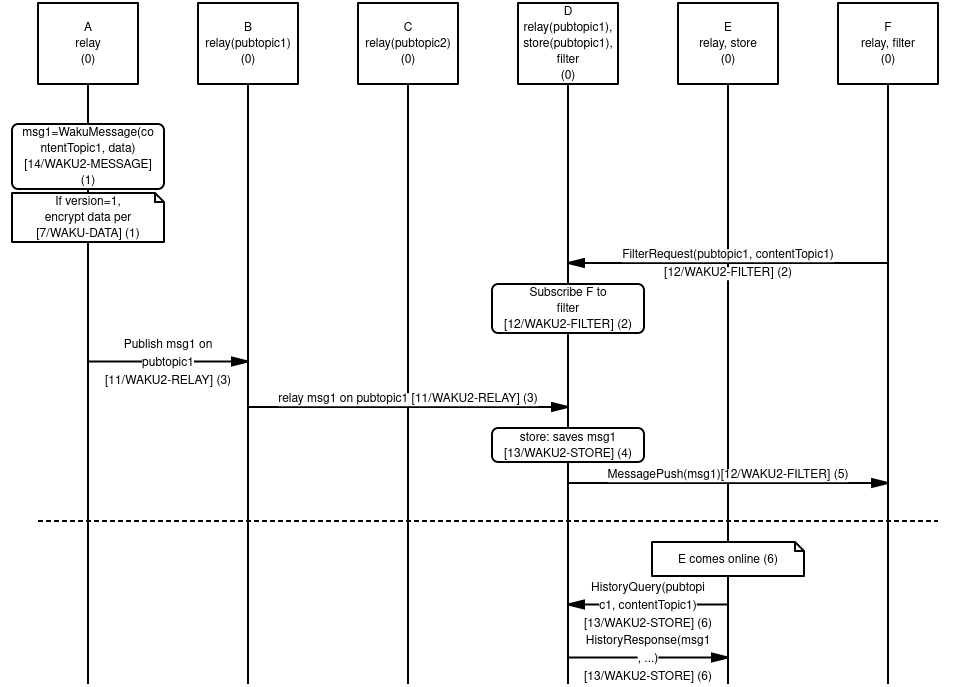

Waku is a privacy-preserving peer-to-peer messaging protocol for resource restricted devices.
It implements PubSub over libp2p and adds capabilities on top of it. These capabilities are:
(i) retrieving historical messages for mostly-offline devices
(ii) adaptive nodes, allowing for heterogeneous nodes to contribute, and
(iii) bandwidth preservation for light nodes.
This makes it ideal for running a p2p protocol on mobile and in similarly restricted environments.

Historically, it has its roots in [Waku v1](/spec/6), which stems from [Whisper](https://eips.ethereum.org/EIPS/eip-627), originally part of the Ethereum stack.
However, Waku v2 acts more as a thin wrapper for PubSub and has a different API.
It is implemented in an iterative manner where initial focus is on porting essential functionality to libp2p.
See [rough road map](https://vac.dev/waku-v2-plan).

# Motivation and goals

1. **Generalized messaging.**
Many applications require some form of messaging protocol to communicate between different subsystems or different nodes.
This messaging can be human-to-human or machine-to-machine or a mix.

2. **Peer-to-peer.**
These applications sometimes have requirements that make them suitable for peer-to-peer solutions.

3. **Resource restricted**.
These applications often run in constrained environments, where resources or the environment is restricted in some fashion. E.g.:

- limited bandwidth, CPU, memory, disk, battery, etc
- not being publicly connectable
- only being intermittently connected; mostly-offline

4. **Privacy.**
These applications have a desire for some privacy guarantees, such as pseudonymity, metadata protection in transit, etc.

Waku provides a solution that satisfies these goals in a reasonable matter.

# Network interaction domains

While Waku is best though of as a single cohesive thing, there are three network
interaction domains:
(a) gossip domain
(b) discovery domain
(c) req/resp domain.

## Protocols and identifiers

The current [protocol identifiers](https://docs.libp2p.io/concepts/protocols/) are:

1. `/vac/waku/relay/2.0.0-beta2`
2. `/vac/waku/store/2.0.0-beta3`
3. `/vac/waku/filter/2.0.0-beta1`
4. `/vac/waku/swap/2.0.0-beta1`
5. `/vac/waku/lightpush/2.0.0-beta1`

These protocols and their semantics are elaborated on in their own specs.

In addition, Waku v2 MAY make use of [libp2p ping protocol](https://docs.libp2p.io/concepts/protocols/#ping) with protocol id

```
/ipfs/ping/1.0.0
```

for liveness checks between peers, or to keep peer-to-peer connections alive.

For the actual content being passed around, see the [7/WAKU-DATA](/spec/7) spec.

## Use of libp2p and protobuf

Unless otherwise specified, all protocols are implemented over libp2p and use Protobuf by default.
Since messages are exchanged over a [bi-directional binary stream](https://docs.libp2p.io/concepts/protocols/),
as a convention, libp2p protocols prefix binary message payloads with the length of the message in bytes.
This length integer is encoded as a [protobuf varint](https://developers.google.com/protocol-buffers/docs/encoding#varints).

## Gossip domain

**Protocol identifier**: `/vac/waku/relay/2.0.0-beta2`

See [11/WAKU2-RELAY](/spec/11) spec for more details.

### Default pubsub topic

The default PubSub topic being used for Waku is currently:
`/waku/2/default-waku/proto`

This indicates that it relates to Waku, is version 2, is the default topic, and
that the encoding of data field is protobuf.

The default PubSub topic SHOULD be used for all protocols.
This ensures a connected network, as well some degree of metadata protection.
It MAY be different if or when:
- Different applications have different message volume
- Topic sharding is introduced
- Encoding is changed
- Version is changed

## Discovery domain

The discovery domain is not yet specified.
As such, currently static nodes should be used.
Please refer to specific implementations for details on publicly available nodes, as these may change over time.

<!-- TODO: To document how we use Discovery v5, EIP-1459 (DNS- based) etc. -->

## Request/reply domain

This consists of two main protocols.
They are used in order to get Waku to run in resource restricted environments,
such as low bandwidth or being mostly offline.

### Historical message support

**Protocol identifier***: `/vac/waku/store/2.0.0-beta3`

See [13/WAKU2-STORE](/spec/13) spec for more details.

### Content filtering

**Protocol identifier***: `/vac/waku/filter/2.0.0-beta1`

See [12/WAKU2-FILTER](/spec/12) spec for more details.

## Overview

See the sequence diagram below for an overview of how the different protocols interact.



0. We have six nodes, A-F.
The protocols initially mounted are indicated as such.
The PubSub topics `pubtopic1` and `pubtopic2` is used for routing and indicates that it is subscribed to messages on that topic for relay, see [11/WAKU2-RELAY](/spec/11) for details.
Ditto for [13/WAKU2-STORE](/spec/13) where it indicates that these messages are persisted on that node.

1. Node A creates a WakuMessage `msg1` with a ContentTopic `contentTopic1`. See [14/WAKU2-MESSAGE](/spec/14) for more details.
If WakuMessage version is set to 1, we use the [6/WAKU1](/spec/6) compatible `data` field with encryption. See [7/WAKU-DATA](/spec/7) for more details.

2. Node F requests to get messages filtered by PubSub topic `pubtopic1` and ContentTopic `contentTopic1`.
Node D subscribes F to this filter and will in the future forward messages that match that filter. See [12/WAKU2-FILTER](/spec/12) for more details.

3. Node A publishes `msg1` on `pubtopic1` and subscribes to that relay topic pick it up.
It then gets relayed further from B to D, but not C since it doesn't subscribe to that topic. See [11/WAKU2-RELAY](/spec/11).

4. Node D saves `msg1` for possible later retrieval by other nodes. See [13/WAKU2-STORE](/spec/13).

5. Node D also pushes `msg1` to F, as it has previously subscribed F to this filter. See [12/WAKU2-FILTER](/spec/12).

6. At a later time, Node E comes online.
It then requests messages matching `pubtopic1` and `contentTopic1` from Node D.
Node D responds with messages meeting this (and possibly other) criteria. See [13/WAKU2-STORE](/spec/13).

# Upgradability and Compatibility

## Compatibility with Waku v1

Waku v1 and Waku v2 are different protocols all together.
They use a different transport protocol underneath; Waku v1 is devp2p RLPx based while Waku v2 uses libp2p.
The protocols themselves also differ as does their data format.
Compatibility can be achieved only by using a bridge that not only talks both devp2p RLPx and libp2p, but that also transfers (partially) the content of a packet from one version to the other.

See [15/WAKU-BRIDGE](/spec/15) for details on a bidirectional bridge mode.

# Security 

Each protocol layer of Waku v2 provides a distinct service and is associated with a separate set of security features and concerns.
Therefore, the overall security of Waku v2 depends on how the different layers are utilized.
In this section, we overview the security properties of Waku v2 protocols against a static adversarial model which is described below.
Note that a more detailed security analysis of each Waku protocol is supplied in its respective specification as well.

## Primary Adversarial Model

In the primary adversarial model, we consider adversary as a passive entity that attempts to collect information from others to conduct an attack,
but it does so without violating protocol definitions and instructions.

The following are **not** considered as part of the adversarial model: 
  -  An adversary with a global view of all the peers and their connections. 
  -  An adversary that can eavesdrop on communication links between arbitrary pairs of peers
  (unless the adversary is one end of the communication).
  Specifically, the communication channels are assumed to be secure.

## Security Features

### Pseudonymity 

Waku v2 by default guarantees pseudonymity for all of the protocol layers since parties do not have to disclose their true identity
and instead they utilize libp2p `PeerID` as their identifiers.
While pseudonymity is an appealing security feature, it does not guarantee full anonymity since the actions taken under the same pseudonym
i.e., `PeerID` can be linked together and potentially result in the re-identification of the true actor. 
  
### Anonymity / Unlinkability

At a high level, anonymity is the inability of an adversary in linking an actor to its data/performed action (the actor and action are context-dependent).
To be precise about linkability, we use the term Personally Identifiable Information (PII) to refer to any piece of data that could potentially be used to uniquely identify a party.
For example, the signature verification key, and the hash of one's static IP address are unique for each user and hence count as PII.
Notice that users' actions can be traced through their PIIs (e.g., signatures) and hence result in their re-identification risk.
As such, we seek anonymity by avoiding linkability between actions and the actors / actors' PII. Concerning anonymity, Waku v2 provides the following features:

**Publisher-Message Unlinkability**:
This feature signifies the unlinkability of a publisher to its published messages in the 11/WAKU2-RELAY protocol.
The [Publisher-Message Unlinkability](/spec/11#security-analysis) is enforced through the `StrictNoSign` policy due to which the data fields of pubsub messages that count as PII for the publisher must be left unspecified.

**Subscriber-Topic Unlinkability**:
This feature stands for the unlinkability of the subscriber to its subscribed topics in the 11/WAKU2-RELAY protocol.
The [Subscriber-Topic Unlinkability](/spec/11/#security-analysis) is achieved through the utilization of a single PubSub topic.
As such, subscribers are not re-identifiable from their subscribed topic IDs as the entire network is linked to the same topic ID.
This level of unlinkability / anonymity is known as [k-anonymity](https://www.privitar.com/blog/k-anonymity-an-introduction/) where k is proportional to the system size (number of subscribers).
Note that there is no hard limit on the number of the pubsub topics, however, the use of one topic is recommended for the sake of anonymity. 

### Spam protection

This property indicates that no adversary can flood the system (i.e., publishing a large number of messages in a short amount of time), either accidentally or deliberately, with any kind of message i.e. even if the message content is valid or useful.
Spam protection is partly provided in `11/WAKU2-RELAY` through the [scoring mechanism](https://github.com/libp2p/specs/blob/master/pubsub/gossipsub/gossipsub-v1.1.md#spam-protection-measures) provided for by GossipSub v1.1.
At a high level, peers utilize a scoring function to locally score the behavior of their connections and remove peers with a low score.
  
### Data confidentiality, Integrity, and Authenticity

Confidentiality can be addressed through data encryption whereas integrity and authenticity are achievable through digital signatures.
These features are provided for in [14/WAKU2-MESSAGE (version 1)](/spec/14#version-1)` through payload encryption as well as encrypted signatures.

## Security Considerations

**Lack of anonymity/unlinkability in the protocols involving direct connections including `13/WAKU2-STORE` and `12/WAKU2-FILTER` protocols**:
The anonymity/unlinkability is not guaranteed in the protocols like `13/WAKU2-STORE` and `12/WAKU2-FILTER` where peers need to have direct connections to benefit from the designated service.
This is because during the direct connections peers utilize `PeerID` to identify each other,
therefore the service obtained in the protocol is linkable to the beneficiary's `PeerID` (which counts as PII).
For `13/WAKU2-STORE`, the queried node would be able to link the querying node's `PeerID` to its queried topics.
Likewise, in the `12/WAKU2-FILTER`, a full node can link the light node's `PeerID`s to its content filter.

<!-- TODO: to inspect the nim-libp2p codebase and figure out the exact use of PeerIDs in direct communication, it might be the case that the requester does not have to disclose its PeerID-->

<!--TODO: might be good to add a figure visualizing the Waku protocol stack and the security features of each layer-->

## Future work

We are actively working on the following features to be added to Waku v2.

**Economic Spam resistance**:
We aim to enable an incentivized spam protection technique to enhance `11/WAKU2-RELAY` by using rate limiting nullifiers.
More details on this can be found in [17/WAKU2-RLNRELAY](/spec/17).
In this advanced method, peers are limited to a certain rate of messaging per epoch and an immediate financial penalty is enforced for spammers who break this rate.

**Prevention of Denial of Service (DoS) and Node Incentivization**:
Denial of service signifies the case where an adversarial node exhausts another node's service capacity (e.g., by making a large number of requests) and makes it unavailable to the rest of the system.
DoS attack is to be mitigated through the accounting model as described in [18/WAKU2-SWAP](/spec/18).
In a nutshell, peers have to pay for the service they obtain from each other.
In addition to incentivizing the service provider, accounting also makes DoS attacks costly for malicious peers.
The accounting model can be used in `13/WAKU2-STORE` and `12/WAKU2-FILTER` to protect against DoS attacks.

Additionally, this gives node operators who provide a useful service to the network an incentive to perform that service.
See [18/WAKU2-SWAP](/spec/18) for more details on this piece of work.

## Appendix A: Implementation Notes

### Implementation Matrix

There are multiple implementations of Waku v2 and its protocols:

- [nim-waku (Nim)](https://github.com/status-im/nim-waku/)
- [go-waku (Go)](https://github.com/status-im/go-waku/)
- [js-waku (NodeJS and Browser)](https://github.com/status-im/js-waku/)

Below you can find an overview of the specs that they implement as they relate to Waku. This includes Waku v1 specs, as they are used for bridging between the two networks.

| Spec | nim-waku (Nim) | go-waku (Go) | js-waku (Node JS) | js-waku (Browser JS) |
| ---- | -------------- | ------------ | ----------------- | -------------------- |
|[6/WAKU1](/spec/6)|✔|||
|[7/WAKU-DATA](/spec/7)|✔|✔||
|[8/WAKU-MAIL](/spec/8)|✔|||
|[9/WAKU-RPC](/spec/9)|✔|||
|[10/WAKU2](/spec/10)|✔|🚧|🚧|🚧|
|[11/WAKU2-RELAY](/spec/11)|✔|✔|✔|✔|
|[12/WAKU2-FILTER](/spec/12)|✔|||
|[13/WAKU2-STORE](/spec/13)|✔|🚧|✔\*|✔\*|
|[14/WAKU2-MESSAGE](/spec/14)|✔|✔|✔|✔|
|[15/WAKU2-BRIDGE](/spec/15)|✔|||
|[16/WAKU2-RPC](/spec/16)|✔|||
|[17/WAKU2-RLNRELAY](/spec/17)|🚧|||
|[18/WAKU2-SWAP](/spec/18)|🚧|||
|[19/WAKU2-LIGHTPUSH](/spec/19)|✔| |✔\**|✔\**|

*js-waku implements [13/WAKU2-STORE](/spec/13) as a querying node only.
**js-waku only implements [19/WAKU2-LIGHTPUSH](/spec/19) requests.


### Recommendations for clients

To implement a minimal Waku v2 client, we recommend implementing the following subset in the following order:

- [10/WAKU2](/spec/10) - this spec
- [11/WAKU2-RELAY](/spec/11) - for basic operation
- [14/WAKU2-MESSAGE](/spec/14) - version 0 (unencrypted)
- [13/WAKU2-STORE](/spec/13) - for historical messaging (query mode only)

To get compatibility with Waku v1:

- [7/WAKU-DATA](/spec/7)
- [14/WAKU2-MESSAGE](/spec/14) - version 1 (encrypted with `7/WAKU-DATA`)

For an interoperable keep-alive mechanism:

- [libp2p ping protocol](https://docs.libp2p.io/concepts/protocols/#ping),
with periodic pings to connected peers

# Copyright

Copyright and related rights waived via [CC0](https://creativecommons.org/publicdomain/zero/1.0/).

# References

1. [6/WAKU1 spec](/spec/6)

2. [Whisper spec (EIP627)](https://eips.ethereum.org/EIPS/eip-627)

3. [Waku v2 plan](https://vac.dev/waku-v2-plan)

4. [Protocol Identifiers](https://docs.libp2p.io/concepts/protocols/)

5. [Protobuf varint encoding](https://developers.google.com/protocol-buffers/docs/encoding#varints)

6. [7/WAKU-DATA spec](/spec/7)

7. [11/WAKU2-RELAY spec](/spec/11)

8. [13/WAKU2-STORE spec](/spec/13)

9. [12/WAKU2-FILTER spec](/spec/12)

10. [15/WAKU2-BRIDGE spec](/spec/15)

11. [k-anonymity](https://www.privitar.com/blog/k-anonymity-an-introduction/)

12. [GossipSub v1.1](https://github.com/libp2p/specs/blob/master/pubsub/gossipsub/gossipsub-v1.1.md)

13. [14/WAKU2-MESSAGE spec](/spec/14)

14. [14/WAKU2-RLNRELAY spec](/spec/17)

15. [18/WAKU2-SWAP spec](/spec/18)

16. [Ping protocol](https://docs.libp2p.io/concepts/protocols/#ping)
