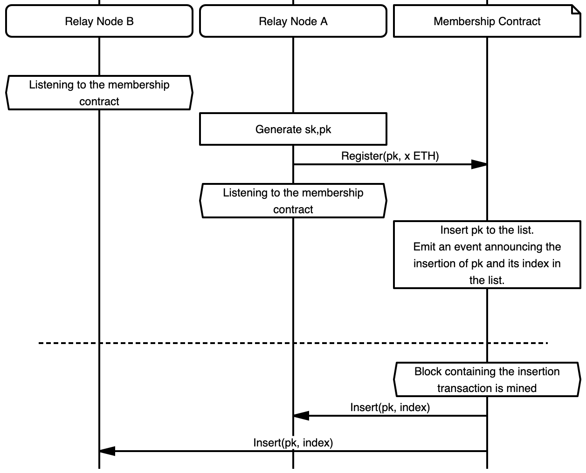

The `17/WAKU-RLN-RELAY` protocol is an extension of `11/WAKU-RELAY` which additionally provides spam protection using [Rate Limiting Nullifiers (RLN)](/spec/32). 

The security objective is to contain spam activity in a GossipSub network by enforcing a global messaging rate to all the peers.
Peers that violate the messaging rate are considered spammers and their message is considered spam.
Spammers are also financially punished and removed from the system. 


**Protocol identifier***: `/vac/waku/waku-rln-relay/2.0.0-alpha1`

# Motivation

In open and anonymous p2p messaging networks, one big problem is spam resistance. 
Existing solutions, such as Whisper’s proof of work are computationally expensive hence not suitable for resource-limited nodes. 
Other reputation-based approaches might not be desirable, due to issues around arbitrary exclusion and privacy.

We augment the [`11/WAKU2-RELAY`](/spec/11) protocol with a novel construct of [RLN](/spec/32) to enable an efficient economic spam prevention mechanism that can be run in resource-constrained environments.


# Flow
The messaging rate is set to 1 per `epoch`, 
where `epoch` indicates the number of `T` seconds elapsed since the Unix epoch event.
The value of `T` is application-dependent.
See section [Recommended System Parameters](#recommended-system-parameters) for some recommended ways to set a sensible `T` value.
Peers subscribed to a spam-protected `pubsubTopic` are only allowed to send one message per `epoch`
(messaging rate MAY be enforced for `WakuMessages` with a specific `contetTopic` published on a `pubsubTopic`, but that is an implementation choice).

## SetUp and Registration
Peers subscribed to a specific `pubsubTopic` form a [rln group](/spec/32).
<!-- link to the rln group definition in the rln RFC -->
Peers MUST be registered to the rln group to be able to publish messages.
Registration is moderated through a smart contract deployed on the Ethereum blockchain. 
Each peer has an [rln key pair](/spec/32) denoted by `sk`  and `pk`.
The `sk` is secret data and MUST be persisted securely by the peer.
The state of the membership contract contains the list of registered members' public identity keys i.e., `pk`s. 
For the registration, a peer creates a transaction that invokes the registration function of the contract via which registers its `pk` in the group. 
The transaction also transfers  `v` amount of ether to the contract to be staked. 
`v` is a system parameter.
The peer who has the "private key" `sk` associated with a registered `pk` would be able to withdraw a portion `p` of the staked fund by providing valid proof. <!-- a secure way to prove the possession of a pk is yet under discussion, maybe via commit and reveal -->
`p` is also a system parameter.

Note that  `sk` is initially only known to its owning peer however, it may get exposed to other peers in case the owner attempts spamming the system i.e., sending more than one message per `epoch`.
An overview of registration is illustrated in Figure 1.




## Publishing

To publish at a given `epoch`, the publishing peer proceeds based on the regular [`11/WAKU2-RELAY`](/spec/11) protocol.  
However, to protect against spamming, each `WakuMessage` (which is wrapped inside the `data` field of a PubSub message) MUST carry a [`RateLimitProof`](##RateLimitProof) with the following fields. 
Section [Payload](#payloads) covers the details about the type and encoding of these fields.

The `merkle_root` contains the root of the Merkle tree.

The `epoch` represents the current epoch.

The `nullifier` is an internal nullifier acting as a fingerprint that allows specifying whether two messages are published by the same peer during the same `epoch`.
The `nullifier` is a deterministic value derived from `sk` and `epoch` therefore any two messages issued by the same peer (i.e., using the same `sk`) for the same `epoch` are guaranteed to have identical `nullifier`s.

The `share_x` and `share_y` can be seen as partial disclosure of peer's `sk` for the intended `epoch`.
They are derived deterministically from peer's `sk` and current `epoch` using [Shamir secret sharing scheme](/spec/32). 
If a peer discloses more than one such pair (`share_x`, `share_y`) for the same `epoch`, it would allow full disclosure of its  `sk` and hence get access to its staked fund in the membership contract.


The `proof` field is a zero-knowledge proof signifying that: 
1. The message owner is the current member of the group i.e., her/his identity commitment key `pk` is part of the membership group Merkle tree with the root `merkle_root`.
2. `share_x` and `share_y`  are correctly computed.
3. The `nullifier` is constructed correctly.
For more details about the proof generation check [RLN](/spec/32)
The proof generation relies on the knowledge of two pieces of private information i.e., `sk` and `authPath`.
The `authPath` is a subset of Merkle tree nodes by which a peer can prove the inclusion of its `pk` in the group. <!-- TODO refer to RLN RFC for authPath def -->
The proof generation also requires a set of public inputs which are: the Merkle tree root `merkle_root`, the current `epoch`, and the message for which the proof is going to be generated. 
In `17/WAKU-RLN-RELAY`, the message is the concatenation of `WakuMessage`'s  `payload` filed and its `contentTopic` i.e., `payload||contentTopic`. 


## Group  Synchronization

Proof generation relies on the knowledge of Merkle tree root `merkle_root` and `authPath` which both require access to the membership Merkle tree. 
Getting access to the Merkle tree can be done in various ways. 
One way is that all the peers construct the tree locally.
This can be done by listening to the registration and deletion events emitted by the membership contract.

For the group synchronization, one important security consideration is that peers MUST make sure they always use the most recent Merkle tree root in their proof generation.
The reason is that using an old root can allow inference about the index of the user's `pk` in the membership tree hence compromising user privacy and breaking message unlinkability.

## Routing

Upon the receipt of a PubSub message via [`11/WAKU2-RELAY`](/spec/11) protocol, the routing peer parses the `data` field as a `WakuMessage` and gets access to the `RateLimitProof` field.  
The peer then validates the `RateLimitProof`  as explained next.

**Epoch Validation**
If the `epoch` attached to the message has more than a threshold `D` gap with the routing peer's current `epoch` then the message is discarded and considered invalid.
This is to prevent a newly registered peer from spamming the system by messaging for all the past epochs. 
`D` is a system parameter for which we provide some recommendations in section [Recommended System Parameters](#recommended-system-parameters).

**Proof Verification**
The routing peers MUST check whether the zero-knowledge proof `proof` is valid.
It does so by running the zk verification algorithm as explained in [RLN](/spec/32). 
If `proof` is invalid then the message is discarded. 

**Spam detection**
To enable local spam detection and slashing routing peers MUST record the `nullifier`, `share_x`, and `share_y` of incoming messages which are not discarded i.e., not found spam or with invalid proof or epoch.
To spot spam messages, the peer checks whether a message with an identical `nullifier` has already been relayed. 
1. If such a message exists and its `share_x` and `share_y` components are different from the incoming message, then slashing takes place.
That is, the peer uses the  `share_x` and `share_y`  of the new message and the  `share'_x` and `share'_y` of the old record to reconstruct the `sk` of the message owner.
The `sk` then can be used to delete the spammer from the group and withdraw a portion of its staked fund.
2. If the `share_x` and `share_y` fields of the previously relayed message are identical to the incoming message, then the message is a duplicate and shall be discarded.
3. If none is found, then the message gets relayed.

An overview of the routing procedure and slashing is provided in Figure 2.


<!-- TODO: may consider [validator functions](https://github.com/libp2p/specs/tree/master/pubsub#topic-validation) or [extended validators](https://github.com/libp2p/specs/blob/master/pubsub/gossipsub/gossipsub-v1.1.md#extended-validators) for the spam detection -->


-------

# Payloads

Payloads are protobuf messages implemented using [protocol buffers v3](https://developers.google.com/protocol-buffers/).
Nodes MAY extend the  [14/WAKU2-MESSAGE](/spec/14) with a `rate_limit_proof` field to indicate that their message is not spam.

```diff 

syntax = "proto3";

message RateLimitProof {
  bytes proof = 1;
  bytes merkle_root = 2;
  bytes epoch = 3;
  bytes share_x = 4;
  bytes share_y = 5;
  bytes nullifier = 6;
}

message WakuMessage {
  bytes payload = 1;
  string contentTopic = 2;
  uint32 version = 3;
  double timestamp = 4;
+ RateLimitProof rate_limit_proof = 21;
}

```
## WakuMessage

`rate_limit_proof` holds the information required to prove that the message owner has not exceeded the message rate limit.
 
## RateLimitProof

The `proof` field is an array of 256 bytes and carries the zkSNARK proof as explained in the [Publishing process](##Publishing).

Other fields of the `RateLimitProof` message are the public inputs to the [rln circuit](/spec/32) and used for the generation of the `proof`.

The `merkle_root` is an array of 32 bytes in little-endian order which holds the root of membership group Merkle tree at the time of publishing the message.
The `merkle_root` is an array of 32 bytes which holds the root of membership group Merkle tree at the time of publishing the message.

The `epoch` is an array of 32 bytes in little-endian order that represents the epoch in which the message is published.

`share_x` and `share_y` are shares of the user's secret identity key `sk`.
`share_x` is an array of 32 bytes and contains the hash of the `WakuMessage`'s `payload` concatenated with its `contentTopic`. 
<!-- We may include other fields in the hash if necessary-->
`share_y` is also an array of 32 bytes which is calculated using [Shamir secret sharing scheme](/spec/32).

The `nullifier` is the internal nullifier encoded as an array of 32 bytes.


# Recommended System Parameters
## Epoch 
A sensible value for the epoch depends on the application for which the spam protection is going to be used.
For example, while the epoch value of `1` second i.e., messaging rate of 1 per second, might be acceptable for a chat application, might be too low for communication among Ethereum network validators.
One should look at the desired throughput of the application to decide on a proper epoch value.
In the proof of concept implementation of `17/WAKU-RLN-RELAY` protocol which is available in [nim-waku](https://github.com/status-im/nim-waku), the messaging rate is set to 1 per second i.e. `T = 1 second`.
Nevertheless, this value is also subject to change depending on user experience.

## Maximum Epoch Gap
We discussed in the [Routing](#routing) section that the gap between the epoch observed by the routing peer and the one attached to the incoming message should not exceed a threshold denoted by `D`.
The value of `D` can be measured based on the following factors.
- `ND`: Network transmission delay: the maximum time that it takes for a message to be fully disseminated in the GossipSub network.
- `CA`: Clock asynchrony: The maximum difference between the Unix epoch clocks perceived by network peers which can be due to clock drifts.
With a reasonable approximation of the preceding values, one can set `D`  as `D = (ND+CA)/T` where `T` is the length of the `epoch` in seconds.
`ND` and `CA` should have the same resolution as `T`.
By this formulation, `D` indeed measures the maximum number of epochs that can elapse since a message gets routed from its origin to all the other peers in the network.

# Copyright

Copyright and related rights waived via [CC0](https://creativecommons.org/publicdomain/zero/1.0/).

# References

1. [RLN documentation](https://hackmd.io/tMTLMYmTR5eynw2lwK9n1w?view)
2. [Public inputs to the rln circuit](https://hackmd.io/tMTLMYmTR5eynw2lwK9n1w?view#Public-Inputs)
3. [Shamir secret sharing scheme used in RLN](https://hackmd.io/tMTLMYmTR5eynw2lwK9n1w?view#Linear-Equation-amp-SSS)
4. [RLN internal nullifier](https://hackmd.io/tMTLMYmTR5eynw2lwK9n1w?view#Nullifiers)