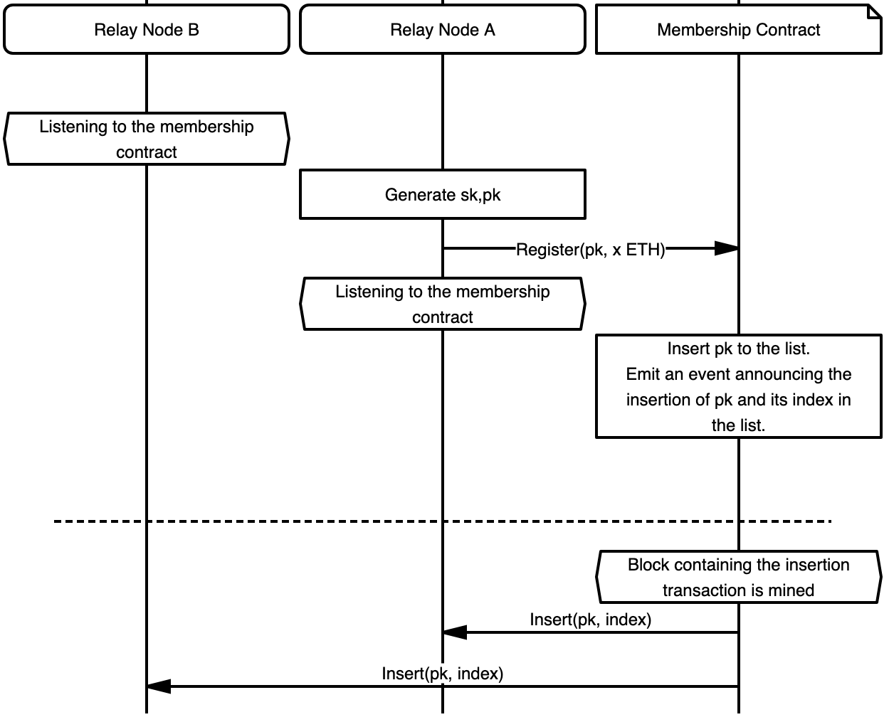
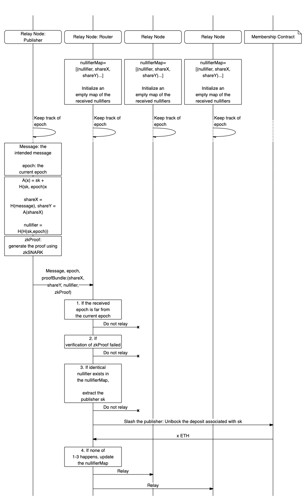

The current specification embodies the details of the spam-protected version of `relay` protocol empowered by Rate Limiting Nullifiers (RLN). 
<!-- More details on RLN can be found in [this spec]() (TODO: to link the spec). -->

The security objective is to control the number of PubSub messages that each peer can publish per epoch where epoch is a system design parameter, regardless of the published topic.


**Protocol identifier***: `/vac/waku/waku-rln-relay/2.0.0-alpha1`

# Motivation

In open p2p messaging networks, one big problem is spam-resistance. 
Existing solutions, such as Whisper’s proof of work, are insufficient, especially for heterogeneous nodes. 
Other reputation-based approaches might not be desirable, due to issues around arbitrary exclusion and privacy.

We augment the `relay` protocol with a novel, light, and effective spam prevention mechanism which also suits the resource-constrained nodes.

<!-- TODO: Fill in more -->


# Flow
## SetUp and Registration
A peer willing to publish a message is required to register. 
Registration is moderated through a smart contract deployed on the Ethereum blockchain. 
The state of the contract contains the list of registered members. 
An overview of registration is illustrated in Figure 1.

For the registration, a peer creates a transaction that sends x (TODO to be specified) ETH to the contract. 
The peer who has the "private key" `sk` associated with that deposit would be able to withdraw x ETH by providing valid proof. 
Note that  `sk` is initially only known by the owning peer however it may get exposed to other peers in case the owner attempts spamming the system i.e., sending more than one message per epoch.

<!-- TODO: the interaction with the contract is subject to change depending on the final implementation -->

<!-- Once registered, the peer obtains the root of the tree (after the registration of the current peer) i.e., `root`  as well as the authenticity path `authPath`. A peer can prove her membership using the `authPath`. -->


<!-- `sk`  and `authPath`  are secret data and MUST be permanently and locally stored by the peer.  -->

<!-- TODO: To specify the details of protobuf messages for the interaction with the contract -->

<!-- diagram -->



<!-- TODO: the function calls in this figure as well as messages are subject to change -->

## Publishing

In order to publish at a given `epoch`, the publishing peer proceeds based on the regular relay protocol.  
However, in order to protect against spamming, each PubSub message must carry a `proof`. 
At a high level, the `proof` is a zero-knowledge proof signifying that the publishing peer is a  registered member, and she has not exceeded the messaging rate at the given `epoch`. 
<!-- TODO: to clarify what a zero-knowledge proof means  -->

The `proof` is embedded inside the `data` field of the PubSub message, which, in the [11/WAKU2-RELAY](/spec/11) protocol, corresponds to the [14/WAKU2-MESSAGE](/spec/14). 

The proof generation relies on the knowledge of two pieces of private information i.e., `sk` and `authPath`.
`authPath` is  the information by which one can prove its membership in the group. <!-- TODO explain what is atuh path -->
To construct `authPath`, peers need to locally store a Merkle tree out of the group members public keys. 
Peers need to keep the tree updated with the recent state of the group.  
Further inputs to the proof generation which are public are tree's `root`, `epoch` and `payload||contentTopic`  where `payload` and `contentTopic` come from the `WakuMessage`. 
The tree `root` can be obtained from the locally maintained Merkle tree.
The proof generation results in the following data items which are encoded inside the `proof`:  
1. `share_x`
2. `share_y`
3. `nullifier`
4. `zkSNARKs`

The preceding values as well as the tree `root` (based on which the proof is generated) are encoded inside the `proof` as `|zkSNARKs<256>|root<32>|epoch<32>|share_x<32>|share_y<32>|nullifier<32>|`.
The numbers enclosed in angle brackets indicate the bit length of the corresponding data item.
The tuple of (`nullifier`, `share_x`, `share_y`)  can be seen as partial disclosure of peer's `sk` for the intended `epoch`.
Given two such tuples with identical `nullifier` but distinct `share_x`, `share_y` results in full disclosure of peer's `sk` and hence burning the associated deposit.
Note that the `nullifier` is a deterministic value derived from `sk` and `epoch` therefore any two messages issued by the same peer (i.e., sing the same `sk`) for the same `epoch` are guaranteed to have identical `nullifier`s.

Note that the `authPath` of each peer depends on the current status of the registration tree (hence changes when new peers register).
As such, it is recommended (and necessary for anonymity) that the publisher updates her `authPath` based on the latest status of the group and attempts the proof using her updated `authPath`.


## Routing

Upon the receipt of a PubSub message, the routing peer needs to extract and parse the `proof` from the `data` field.  
If the `epoch` attached to the message has a non-reasonable gap (TODO: the gap should be defined) with the routing peer's current `epoch` then the message must be dropped (this is to prevent a newly registered peer spamming the system by messaging for all the past epochs). 
Furthermore, the routing peers MUST check whether the `proof` is valid and the message is not spam. 
If both checks are passed successfully, then the message is relayed. 
If `proof` is invalid then the message is dropped. 
If spamming is detected, the publishing peer gets slashed. 
An overview of routing procedure is depicted in Figure 2.

### Spam Detection and Slashing
In order to enable local spam detection and slashing, routing peers MUST record the `nullifier`, `share_x`, and `share_y` of any incoming message conditioned that it is not spam and has valid proof. 
To do so, the peer should follow the following steps. 
1. The routing peer first verifies the `zkSNARKs` and drops the message if not verified. 
2. Otherwise, it checks whether a message with an identical `nullifier` has already been relayed. 
   1. If such message exists and its `share_x` and `share_y` components are different from the incoming message, then slashing takes place (if the `share_x` and `share_y` fields of the previously relayed message is identical to the incoming message, then the message is a duplicate and shall be dropped).
   2. If none found, then the message gets relayed.

An overview of slashing procedure is provided in Figure 2.

<!-- TODO: may shorten or delete the Spam detection and slashing process -->

<!-- TODO: may consider [validator functions](https://github.com/libp2p/specs/tree/master/pubsub#topic-validation) or [extended validators](https://github.com/libp2p/specs/blob/master/pubsub/gossipsub/gossipsub-v1.1.md#extended-validators) for the spam detection -->



<!-- TODO: the function calls in this figure as well as messages are subject to change -->

# Security Considerations

<!-- TODO: add discussion about the anonymity (e.g., the `StrictNoSign` policy) -->

<!-- TODO: discuss about the economic spam guarantees -->

-------

# Payloads

Payloads are protobuf messages implemented using [protocol buffers v3](https://developers.google.com/protocol-buffers/).
Nodes MAY extend the  [14/WAKU2-MESSAGE](/spec/14) with a `proof` field to indicate that their message is not a spam.

```diff 

syntax = "proto3";

message RateLimitProof {
  bytes proof = 1;
  bytes merkle_root = 2;
  bytes epoch = 3;
  bytes share_x = 4;
  bytes share_y = 5;
  bytes nullifier = 6;
}

message WakuMessage {
  bytes payload = 1;
  string contentTopic = 2;
  uint32 version = 3;
  double timestamp = 4;
+ RateLimitProof rate_limit_proof = 21;
}

```
## WakuMessage

`rate_limit_proof` holds the information required to prove that the message owner has not exceeded the message rate limit.
 
## RateLimitProof

The `proof` field is an array of 256 bytes and carries the zkSNARK proof as explained in the [Publishing process](##Publishing).
The proof asserts that:
1. The message publisher is the current member of the group i.e., her/his identity commitment key is part of the membership group Merkle tree with the root `merkleRoot`.
2. `share_x` and `share_y`  are correctly computed.
3. The `nullifier` is constructed correctly.

Other fields of the `RateLimitProof` message are the public inputs to the rln circuit and used for the generation of the `proof`.

The `merkleRoot` is an array of 32 bytes which holds the root of membership group Merkle tree at the time of publishing the message.

The `epoch` is an array of 32 bytes that represents the epoch in which the message is published.
<!-- TODO epoch is going to change to a different type -->

`share_x` and `share_y` are shares of the user's identity key.
These shares are created using [Shamir secret sharing scheme](##Publishing). 
`share_x` is an array of 32 bytes and contains the hash of the `WakuMessage`'s `payload` concatenated with its `contentTopic`. 
<!-- TODO hash other fields if necessary-->
`share_y` is also an array of 32 bytes which is calculated using [Shamir secret sharing scheme](##Publishing).

The `nullifier` is an internal nullifier which allows specifying whether two messages are published by the same publisher during the same `epoch`.
It is an array of 32 bytes.

<!-- TODO to reflect this change on WakuMessage spec once the PR gets mature -->

# Copyright

Copyright and related rights waived via [CC0](https://creativecommons.org/publicdomain/zero/1.0/).

# References

1. [RLN documentation](https://hackmd.io/tMTLMYmTR5eynw2lwK9n1w?view)
2. [Public inputs to the rln circuit](https://hackmd.io/tMTLMYmTR5eynw2lwK9n1w?view#Public-Inputs)
3. [Shamir secret sharing scheme used in RLN](https://hackmd.io/tMTLMYmTR5eynw2lwK9n1w?view#Linear-Equation-amp-SSS)
4. [RLN internal nullifier](https://hackmd.io/tMTLMYmTR5eynw2lwK9n1w?view#Nullifiers)