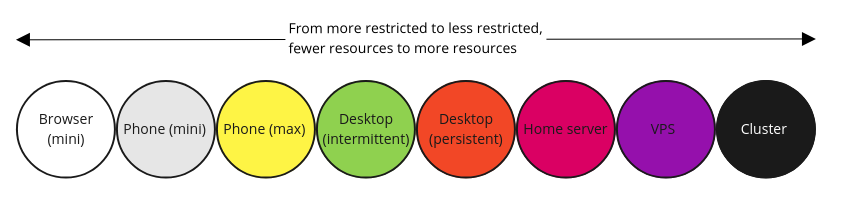
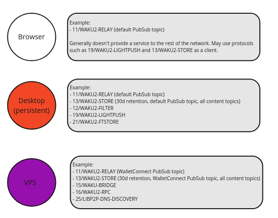
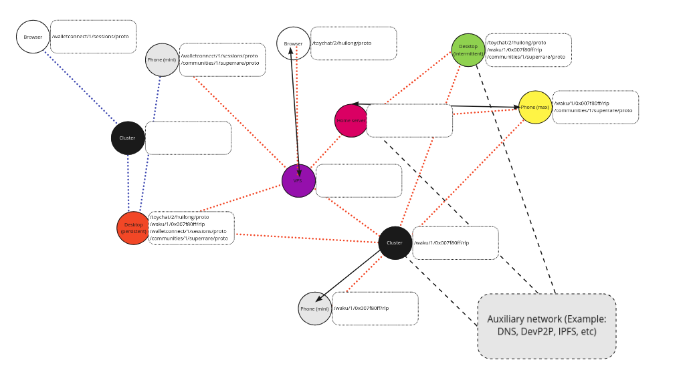
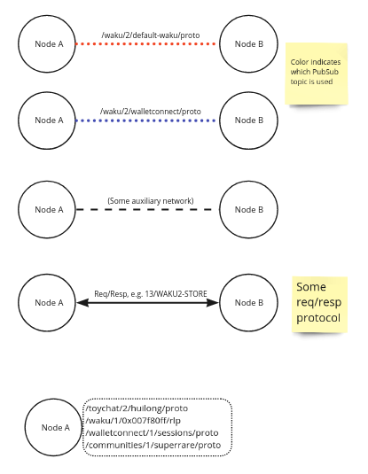
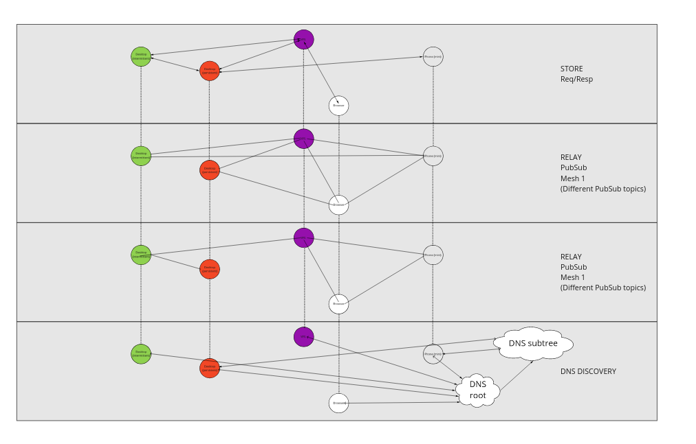

This is an informational spec that show cases the concept of adaptive nodes.

# Node types - a continuum

We can look at node types as a continuum, from more restricted to less restricted, fewer resources to more resources.

## Possible limitations

- Connectivity: Not publicly connectable vs static IP and DNS
- Connectivity: Mostly offline to mostly online to always online
- Resources: Storage, CPU, Memory, Bandwidth

## Accessibility and motivation

Some examples:

- Opening broser window: costs nothing, but contribute nothing
- Desktop: download, leave in background, contribute somewhat
- Cluster: expensive, upkeep, but can contribute a lot

These are also illustrative, so a node in a browser in certain environment might contribute similarly to Desktop.

## Adaptive nodes

We call these nodes *adaptive nodes* to highlights different modes of contributing, such as:

- Only leeching from the network
- Relaying messages for one or more topics
- Providing services for lighter nodes such as lightpush and filter
- Storing historical messages to various degrees
- Ensuring relay network can't be spammed with RLN

## Planned incentives

Incentives to run a node is currently planned around:

- SWAP for accounting and settlement of services provided
- RLN RELAY for spam protection
- Other incentivization schemes are likely to follow and is an area of active research

# Node protocol selection

Each node can choose which protocols to support, depending on its resources and goals.

In the case of protocols like 11/WAKU2-RELAY etc (12, 13, 19, 21) these correspond to Libp2p protocols.

However, other protocols like 16/WAKU2-RPC (local HTTP JSON-RPC), 25/LIBP2P-DNS-DISCOVERY, Discovery v5 (DevP2P) or interfacing with distributed storage, are running on different network stacks.

This is in addition to protocols that specify payloads, such as 14/WAKU2-MESSAGE, 26/WAKU2-PAYLOAD, or application specific ones. As well as specs that act more as recommendations, such as 23/WAKU2-TOPICS or 27/WAKU2-PEERS.

# Waku network visualization

We can better visualize the network with some illustrative examples.

## Topology and topics

The first one shows an example topology with different PubSub topics for the relay protocol.

## Legend

The dotted box shows what content topics (application-specific) a node is interested in.

A node that is purely providing a service to the network might not care.

In this example, we see support for toy chat, a topic in Waku v1 (Status chat), WalletConnect, and SuperRare community).

## Auxiliary network

This is a separate component with its own topology.

Behavior and interaction with other protocols specified in Vac RFCs, e.g. 25/LIBP2P-DNS-DISCOVERY, 15/WAKU-BRIDGE, etc.

## Node Cross Section

This one shows a cross-section of nodes in different dimensions and shows how the connections look different for different protocols.

# Copyright

Copyright and related rights waived via [CC0](https://creativecommons.org/publicdomain/zero/1.0/).
