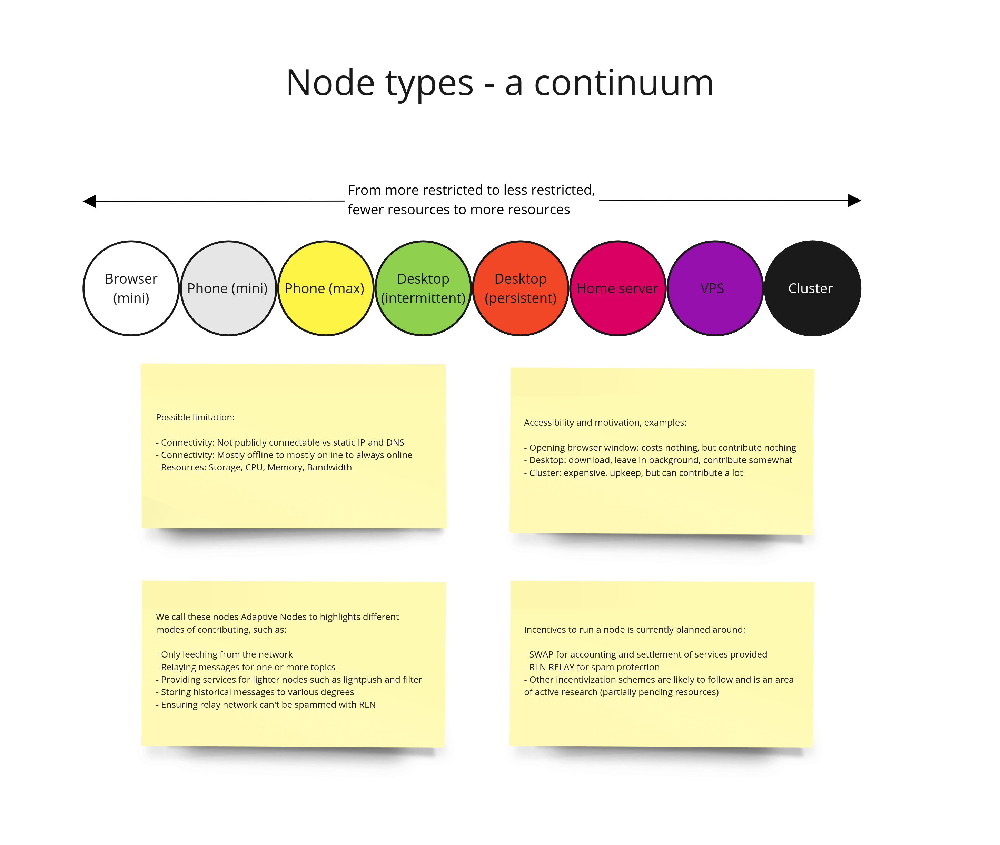
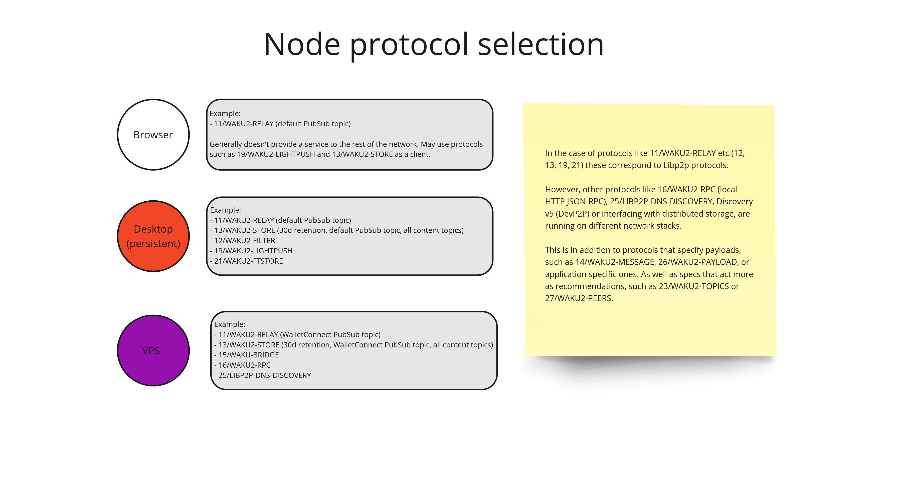
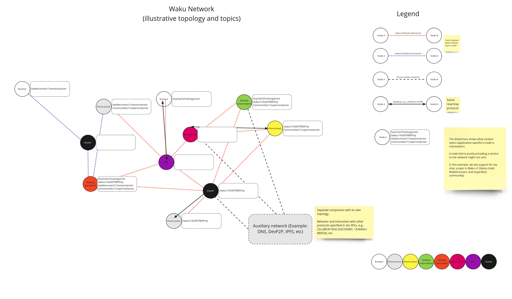
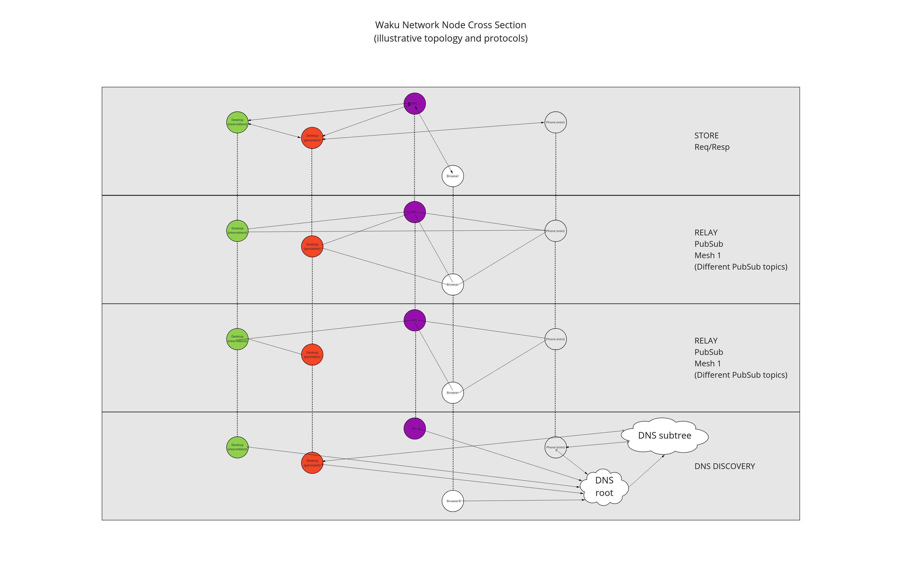

This is an informational spec that show cases the concept of adaptive nodes.

# Node types - a continuum

We can look at node types as a continuum, from more restricted to less restricted, fewer resources to more resources.

**TODO: Bring this out from image**

# Node protocol selection

Each node can choose which protocols to support, depending on its resources and goals.

**TODO: Bring this out from image**

# Waku network visualization

We can better visualize the network with some illustrative examples.

## Topology and topics

The first one shows an example topology with different PubSub topics for the relay protocol.

**TODO: Split image up more**
**TODO: Bring text out from image**

## Node Cross Section

This one shows a cross-section of nodes in different dimensions and shows how the connections look different for different protocols.

**TODO: Split image up more**

# Copyright

Copyright and related rights waived via [CC0](https://creativecommons.org/publicdomain/zero/1.0/).
