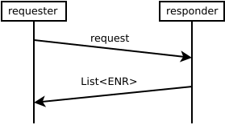

# Abstract

This document specifies a simple request-response peer exchange protocol.
Responders send information about a requested number of peers.
The main purpose of this protocol is providing resource restricted devices with peers.

# Background and Motivation

Resource restricted devices may not feasibly be able to take part in distributed random sampling ambient peer discovery protocols such as [33/WAKU2-DISCV5](https://rfc.vac.dev/spec/33/).
The Waku peer discovery protocol specified in this document allows resource restricted devices to request a list of peers from a (stronger) peer.
Network parameters necessary to connect to this stronger peer can, for instance, be learned from a static bootstrapping method.
The advantage of using Waku peer exchange to discover new peers over simply adding static bootstrap peers to the peer list is a more even load distribution.
If a lot of (resource restricted) nodes would use static bootstrap nodes as relay or store nodes, the load on these would be very high.
Heavily used static nodes also add a centralized element. Downtime of such a node might significantly impact the network.

However, the resource efficiency of this protocol comes at an anonymity cost, which is explained in the [Security/Privacy Considerations](#securityprivacy-considerations) section.
This protocol SHOULD only be used if [33/WAKU2-DISCV5](https://rfc.vac.dev/spec/33/) is infeasible.

# Theory and Protocol Semantics

The peer exchange protocol specified in this document is a simple request-response protocol.
As Figure 1 illustrates, the requesting node sends a request to a peer, which acts as the responder.
The responder replies with a list of [multiaddresses](https://docs.libp2p.io/concepts/addressing/).



In order to protect its anonymity, the responder MUST NOT provide peers from its actively used peer list as this opens pathways to *Neighbourhood Surveillance* attacks, as described in the
[Security/Privacy Considerations Section](#securityprivacy-considerations).
The responder SHOULD retrieve a new random set of peers via [33/WAKU2-DISCV5](https://rfc.vac.dev/spec/33/).
This both protects the responder's anonymity as well as helps distributing load.

Requesters, in the context of the specified peer exchange protocol, SHOULD be resource restricted devices.
While any node could technically act as a requester, using the peer exchange protocol comes with two drawbacks

* reducing [anonymity](#securityprivacy-considerations)
* causing load on responder nodes


# Wire Format Specification

```protobuf
syntax = "proto3";

message PeerInfo {
  repeated bytes multiaddrs = 1;
}

message PeerExchangeQuery {
  int numPeers; // number of peers requested
}

message PeerExchangeResponse {
  repeated PeerInfo peerInfos = 1;
}

message PeerExchangeRPC {
  PeerExchangeQuery query = 1;
  PeerExchangeResponse response = 2;
}

```

Requesters send `PeerExchangeQuery` to a peer.
Responders SHOULD include a maximum of `numPeers` `PeerInfo` instances into a response.
Responders send a `PeerExchangeResponse` to requesters containing a list of `PeerInfo` instances, which in turn hold a list of multiaddresses of the provided peers.
These multiaddresses allow the requester to connect to the respective peers.

# Implementation Suggestions

Implementations can implement the [libp2p discovery interface](https://github.com/status-im/nim-libp2p/issues/140).

# Security/Privacy/Anonymity Considerations

The peer exchange protocol specified in this document comes with anonymity and security implications.
We differentiate these implications into the requester and responder side, respectively.

## Requester

With a simple peer exchange protocol, the requester is inherently susceptible to both *neighbourhood surveillance* and *controlled neighbourhood* attacks.

To mount a *neighbourhood surveillance* attack, an attacker has to connect to the peers of the victim node.
The peer exchange protocol allows a malicious responder to easily get into this position.
The responder connects to a set of peers and simply returns this set of peers to the requester.

The peer exchange protocol also makes it much easier to get into the position required for the *controlled neighbourhood* attack:
A malicious responder provides controlled peers in the response peer list.

More on these attacks may be found in our [research log article](https://vac.dev/wakuv2-relay-anon).

As a weak mitigation the requester MAY ask several peers and select a subset of the returned peers.

## Responder

Responders that answer with active mesh peers are more vulnerable to a *neighbourhood surveillance* attack.
Responding with the set of active mesh peers allows a malicious requester to get into the required position more easily.
It takes away the first hurdle of the *neighbourhood surveillance* attack: The attacker knows which peers to try to connect to.
This increased vulnerability can be avoided by only responding with random sampled sets of peers, e.g. by requesting a random peer set via [33/WAKU2-DISCV5](https://rfc.vac.dev/spec/33/).

Responders are also susceptible to amplification DoS attacks.
Requesters send a simple message request which causes responders to engage in ambient peer discovery to retrieve a new random peer set.
As a mitigation, responders MAY feature a `seen cache` for requests and only answer once per time interval.

# Copyright

Copyright and related rights waived via [CC0](https://creativecommons.org/publicdomain/zero/1.0/).

# References

* [33/WAKU2-DISCV5](https://rfc.vac.dev/spec/33/)
* [multiaddress](https://docs.libp2p.io/concepts/addressing/).
* [libp2p discovery interface](https://github.com/status-im/nim-libp2p/issues/140).
* [Waku relay anonymity](https://vac.dev/wakuv2-relay-anon).
