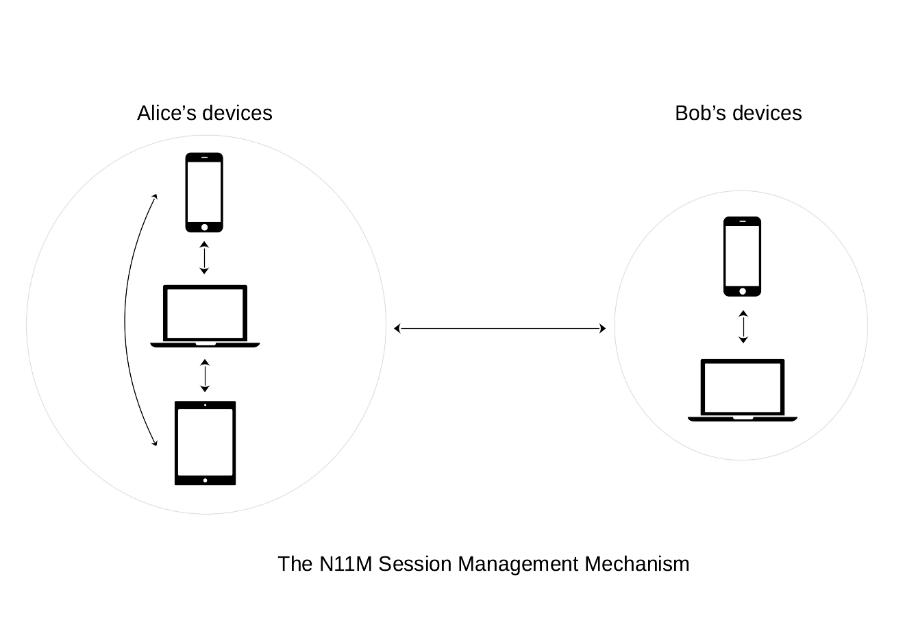
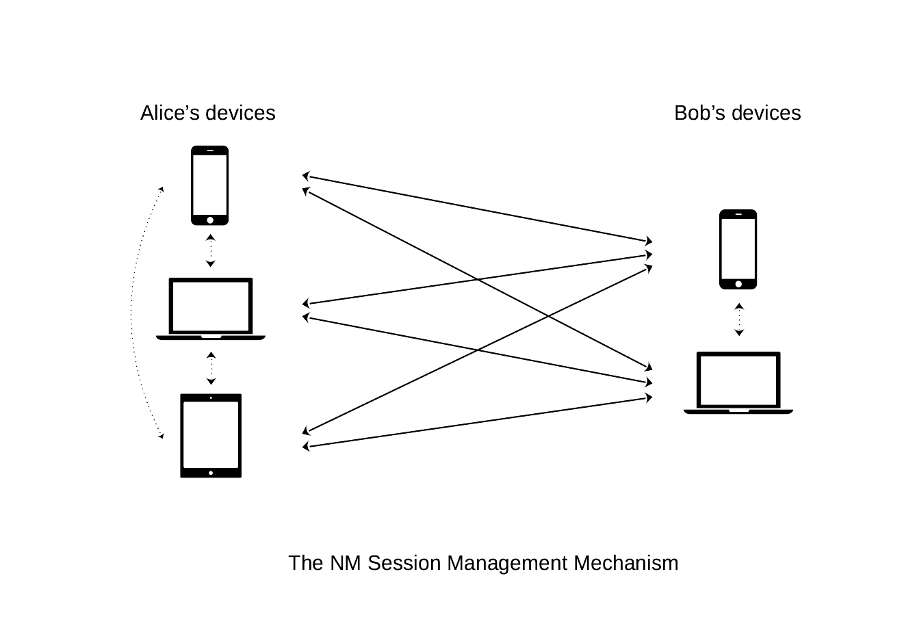

# Introduction

In [35/WAKU2-NOISE](https://rfc.vac.dev/35/) we defined how Waku messages' payloads can be encrypted using key material derived from key agreements based on the [Noise Protocol Framework](http://www.noiseprotocol.org/noise.html). 

Once two users complete a Noise handshake, 
an encryption/decryption session - _or a Noise session_ - would be instantiated.

This post provides an overview on how we can possibly implement and manage one or multiple Noise sessions in Waku.

# Preliminaries

We assume that two users, e.g. Alice and Bob, successfully completed a Noise handshake.

Using [Noise terminology]((http://www.noiseprotocol.org/noise.html)), at the end of the handshake they will share:
- two _Cipher States_ `CSOutbound` and `CSInbound`, to encrypt and decrypt outbound and inbound messages, respectively;
- a handshake hash value `h`.

As suggested in Noise specifications in regards to [Channel Binding](http://www.noiseprotocol.org/noise.html#channel-binding), 
we can identify a Noise session with a `session-id` derived from the handshake hash value `h` shared on completion of a Noise handshake.

More specifically, when Alice and Bob call [Split()](http://www.noiseprotocol.org/noise.html#the-symmetricstate-object) in order to derive the two final encryption and decryption Cipher States, 
they further compute `session-id  = HKDF(h)` using the supported key derivation function `HKDF`.

Such `session-id` will uniquely identify the Noise cryptographic session instantiated on completion of a Noise handshake,
which would then consist of the tuple `(session-id, CSOutbound, CSInbound)`. 

Once a Noise session is instantiated, 
any further encrypted message between Alice and Bob within this session is exchanged on a `contentTopic` with name `/{application-name}/{application-version}/wakunoise/1/sessions/{ct-id}/proto`, 
where `ct-id = Hash(Hash(session-id))` 
and `/{application-name}/{application-version}/` identifies the application currently employing [35/WAKU2-NOISE](https://rfc.vac.dev/35/).

# Session states

A Noise session corresponding to a certain `session-id`:
- is always **active** as long as it is not marked as **stale**. 
For an active `session-id`, new messages are published on the content topic `/{application-name}/{application-version}/wakunoise/1/sessions/{ct-id}/proto`;  
- is marked as **stale** if a [session termination message](https://rfc.vac.dev/spec/35/#session-termination-message) containing `Hash(session-id)` is published on the content topic `/{application-name}/{application-version}/wakunoise/1/sessions/{ct-id}/proto`. 
Session information relative to stale sessions  MAY be deleted from users' device, unless required for later channel binding purposes.

When a Noise session is marked as stale, it means that one party requested its termination while being online, 
since publication of a hash pre-image for `ct-id` is required (i.e. `Hash(session-id)`).

Currently, it is not possible to mark a Noise session as stale when `session-id` is lost or gets corrupted in users' devices.
However, since `session-id` is shared between Alice and Bob, 
one party MAY decide to mark a Noise session as stale if no message from the other end was received within a certain fixed time window. 

The above mechanism allows a Noise session to be marked as stale either privately or publicly, 
depending if `Hash(session-id)` is sent on `/{application-name}/{application-version}/wakunoise/1/sessions/{ct-id}/proto` to the other party in encrypted form or not, respectively. 

When a Noise session is publicly marked as stale, 
network peers MAY discard all [stored](https://rfc.vac.dev/spec/13/) messages addressed to the content topic `/{application-name}/{application-version}/wakunoise/1/sessions/{ct-id}/proto`. 
In this the case and in order for parties to retrieve any eventually delayed message, 
peers SHOULD wait a fixed amount of time before discarding stored messages corresponding to a stale Noise session. 

A stale Noise session cannot be directly marked as active
and parties are required to instantiate a new Noise session if they wish to communicate again. 

However, parties can optionally include the `session-id` corresponding to a stale Noise session in the [prologue information](https://noiseprotocol.org/noise.html#prologue) employed in the Noise handshake they execute to instantiate their new Noise session. 
This effectively emulates a mechanism to _"re-activate"_ a stale Noise session by binding it to a newly created active Noise session.

In order to reduce users' metadata leakage, it is desirable (as suggested in [35/WAKU2-NOISE](https://rfc.vac.dev/spec/35/#after-handshake)) that content topics used for communications change every time a new message is exchanged.
This can be easily realized by employing a key derivation function to compute a new `session-id` from the previously employed one (e.g. `session-id = HKDF(prev-session-id)`),
while keeping the Inbound/outbound Cipher States, the content topic derivation mechanism and the stale mechanism the same as above.
In this case, when one party sends **and** receives at least one message, 
he SHALL publicly mark as stale all Noise sessions relative to messages exchanged before the earlier of these two send/receive events.

# Multi-Device support

Alice and Bob might possess one or more devices (e.g. laptops, smartphones, etc.) they wish to use to communicate.
In the following, we assume Alice and Bob to possess $N$ and $M$ devices, respectively.

Since a Noise session contains cryptographic material required to encrypt and decrypt messages exchanged on a pre-defined content topic derived from a `session-id`, 
messages should be encrypted and decrypted within the Noise session instantiated between the currently-in-use sender's and receiver's device.

This is achieved through two main supported session management mechanisms that we called `N11M` and `NM`, respectively.

## The $N11M$ session management mechanism

In a $N11M$ setting, each party's device shares the same Noise session information used to encrypt and decrypt messages exchanged with the other party.

More precisely, once the first Noise session between any of Alice's and Bob's device is instantiated, 
its session information is securely propagated to all other devices, 
which then become able to send and receive new messages on the content topic associated to such session.

The most updated session information between Alice and Bob is propagated in encrypted form to other devices, 
using previously instantiated Noise sessions. 
The propagated session information corresponds to the latest session information stored on the device currently communicating with (any of the devices of) the other party.

We note that sessions information is propagated only among devices belonging to the same party and not with other party's devices. 
Hence, Alice has no knowledge on the number of devices Bob is using and vice versa. 

When any device marks a Noise session between Alice and Bob as stale, 
all (updated) devices will implicitly mark such session as stale.

In case a Noise session between two devices belonging to the same party is marked as stale, 
such two devices stop to reciprocally propagate any information regarding Noise sessions instantiated with other parties.

As regards security, an attacker that compromises an encrypted message propagating session information,
might be able to compromise one or multiple messages exchanged within the session such information refers to. 
This can be mitigated by adopting techniques similar to the the ones proposed in [35/WAKU2-NOISE](https://rfc.vac.dev/spec/35/#after-handshake), 
where encryption keys are changed every time a new message is exchanged.

This session management mechanism is loosely based on the paper ["Multi-Device for Signal"](https://eprint.iacr.org/2019/1363.pdf).

## The $NM$ session management mechanism

In a $NM$ setting, we require all of $N$ Alice's devices to have an active Noise session with each of Bob's $M$ devices, 
for a total of $NM$ concurrently active Noise sessions between Alice and Bob.

A message is sent from the currently-in-use sender's device to all recipent's devices, 
by properly encrypting and sending it to the content topics of each corresponding active Noise session. 

We note that this allows the recipient to receive a message on all his devices simultaneously. 
However, on the sender side, only the device which effectively sent the message will know its full content.

If it is required for sent messages to be available on all sender's devices, 
each pair of sender's devices SHOULD have an active Noise session used for syncing purposes: 
this sums up to a total of $N-1$ and $M-1$ extra Noise sessions instantiated on each Alice's and Bob's device, respectively.

Thus, if Alice wants to send a message to Bob from one of her $N$ devices, 
she encrypts and sends her message to each of Bob's $M$ devices 
(and, eventually, to each of her other $N-1$ devices),
using the appropriate Noise session information. 

If one device marks a Noise session as stale, 
all active sessions instantiated with such device SHOULD be marked as stale as soon as possible. 
If the device declaring a stale session does not send a session termination message to all the other party's devices with which has an active session, 
the other party SHOULD send a termination message to mark all such Noise sessions as stale.

This session management mechanism is loosely based on [Signal's Sesame Algorithm](https://signal.org/docs/specifications/sesame/).

# References
- [13/WAKU2-STORE](https://rfc.vac.dev/spec/13/)
- [35/WAKU2-NOISE](https://rfc.vac.dev/35/)
- [The Noise Protocol Framework](http://www.noiseprotocol.org/noise.html)
- [The Sesame Algorithm: Session Management for Asynchronous Message Encryption](https://signal.org/docs/specifications/sesame/)
- ["Multi-Device for Signal"](https://eprint.iacr.org/2019/1363.pdf)