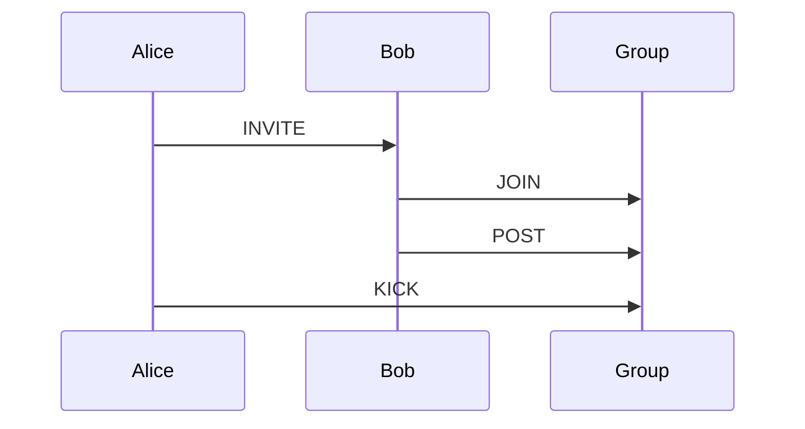

# Minimal Data Sync Client

> Version: 0.1.0 (Draft)
> 
> Authors: Oskar Thorén oskar@status.im, Dean Eigenmann dean@status.im

## Table of Contents

1. [Abstract](#abstract)
2. [Definitions](#definitions)
3. [Footnotes](#footnotes)
4. [Acknowledgements](#acknowledgements)

## Abstract

In this specification we define a minimal data sync client that utilizes [minimal viable data sync](./mvds.md) to distribute messages amongst participants.

## Definitions

| Term        | Definition                                                                             |
| ----------- | -------------------------------------------------------------------------------------- |
| **Message** | A client message of either the type `INVITE`, `JOIN`, `LEAVE`, `KICK`, `ACK` or `POST` |

## Chat Types

<!-- Not sure whether we need separate chat types or chat scenarios. They aren't really protocol dependent as we fall back to some form of group-chat for all of them.

Is this accurate? I also feel like this is rather confusing, shouldn't this be separate clients?

-->

- **Private Chat:** Chats between 2 parties.
- **Group:**
- **Public Chat:**

## Message

The new message data structure is based on the [status protocol message](https://github.com/status-im/specs/blob/master/protocol.md#payload).

```protobuf
message Message {

    enum MessageType {
        INVITE = 0;
        JOIN = 1;
        LEAVE = 2;
        KICK = 3;
        ACK = 4;
        POST = 5;
    }

    MessageType message_type = 1;
    bytes body = 2;
    bytes previous_message = 3;
    bytes signature = 4;
}
```

| Field                | Description                                                                                                |
| :------------------: | ---------------------------------------------------------------------------------------------------------- |
| **message_type**     | [Message Type](#types)                                                                                     |
| **body**             | The actual message body.                                                                                   |
| **previous_message** | The `message identifier` of the previous message sent by the node in this group.                           |
| **signature**        | Signed `HASH(message_type, body, previous_message)`                                                        |

<!--@TODO WORD BETTER?-->
**Note:** For purposes of signing `message_type` MUST be encoded as a uint32 little-endian.

**Message Identifiers** refer to the identifiers provided by MVDS for messages.

The current `HASH` function used is `sha256`.

<!-- this needs to be one layer up, status client which is a data sync client.
**Note:** The `POST` for a text message is:
 ```
 <content-type><content>
 ```__

Where `content` is the `utf-8` encoded content and `content-type` is `uint8` encoded big endian of:
1. `text/plain`
2. `sticker`
3. `status`
4. `command-request`
5. `emoji`
-->

<!-- Might make sense to have separate sub sections for this -->

### Types

- **`0` INVITE:** -
- **`1` JOIN:** -
- **`2` LEAVE:** Sent by a `peer` when leaving a group, or by a group creator when dissolving the group. 
- **`3` KICK:** ? Not sure if we need this
- **`4` ACK:** Acknowledgements for `JOIN`, `LEAVE` and `KICK` messages. <!-- We may not need this as we can rely on the acks of data sync -->
- **`5` POST:** *seems like a good name instead of message, makes less sense for private chats maybe?*

## Flow

<!-- This section is only here for research right now, might move or be unnecessary -->



<!-- 

What happens to message order if user is kicked but they pretend they didn't see it? Need some sort of topological 'smash' to ensure this is respected

-->

## Footnotes

## Acknowledgements

