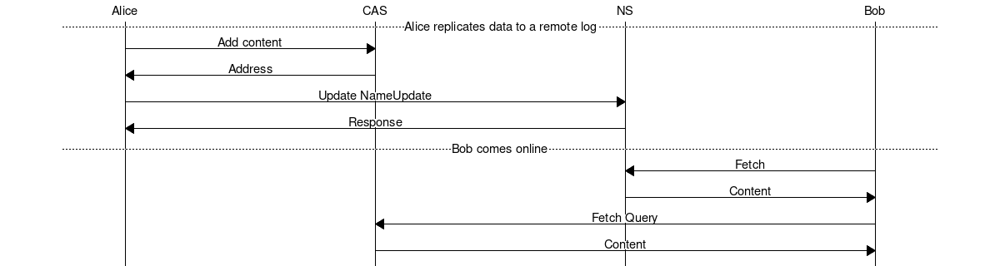

# Remote log specification

> Version: 0.1.1 (Draft)
>
> Authors: Oskar Thorén oskar@status.im, Dean Eigenmann dean@status.im

## Table of Contents

- [Abstract](#abstract)
- [Definitions](#definitions)
- [Wire Protocol](#wire-protocol)
    - [Secure Transport, storage, and name system](#secure-transport-storage-and-name-system)
    - [Payloads](#payloads)
- [Synchronization](#synchronization)
    - [Roles](#roles)
    - [Flow](#flow)
    - [Remote log](#remote-log)
    - [Next page semantics](#next-page-semantics)
    - [Interaction with MVDS](#interaction-with-mvds)
- [Footnotes](#footnotes)
- [Acknowledgements](#acknowledgements)

## Abstract

A remote log is a replication of a local log. This means a node can read data from a node that is offline.

This specification is complemented by a proof of concept implementation <sup>1</sup>.

## Definitions

| Term        | Definition                                                                                   |
| ----------- | --------------------------------------------------------------------------------------       |
| CAS         | Content-addressed storage. Stores data that can be addressed by its hash.                    |
| NS          | Name system. Associates mutable data to a name.                                              |
| Remote log  | Replication of a local log at a different location.                                          |

## Wire Protocol

### Secure Transport, storage, and name system

This specification does not define anything related to: secure transport,
content addressed storage, or the name system. It is assumed these capabilities
are abstracted away in such a way that any such protocol can easily be
implemented.

<!-- TODO: Elaborate on properties required here. -->

### Payloads

Payloads are implemented using [protocol buffers v3](https://developers.google.com/protocol-buffers/).

**CAS service**:

```protobuf
syntax = "proto3";

package vac.cas;

service CAS {
  rpc Add(Content) returns (Address) {}
  rpc Get(Address) returns (Content) {}
}

message Address {
  bytes id = 1;
}

message Content {
  bytes data = 1;
}
```

<!-- XXX/TODO: Can we get rid of the id/data complication and just use bytes? -->

**NS service**:

```protobuf
syntax = "proto3";

package vac.cas;

service NS {
  rpc Update(NameUpdate) returns (Response) {}
  rpc Fetch(Query) returns (Content) {}
}

message NameUpdate {
  string name = 1;
  bytes content = 2;
}

message Query {
  string name = 1;
}

message Content {
  bytes data = 1;
}

message Response {
  bytes data = 1;
}
```

<!-- XXX: Response and data type a bit weird, Ok/Err enum? -->
<!-- TODO: Do we want NameInit here? -->

**Remote log:**

```protobuf
syntax = "proto3";

package vac.cas;

message RemoteLog {
  repeated Pair pair = 1;
  bytes tail = 2;

  message Pair {
    bytes remoteHash = 1;
    bytes localHash = 2;
    bytes data = 3;
  }
}
```

<!-- TODO: Better name for Pair, Mapping? -->

<!-- TODO: Extend pair with (optional) data -->

## Synchronization

<!-- TODO: Elaborate on interaction with MVDS, especially with what messages are synced, etc -->

### Roles

There are four fundamental roles:

1. Alice
2. Bob
2. Name system (NS)
3. Content-addressed storage (CAS)

The *remote log* protobuf is what is stored in the name system.

"Bob" can represent anything from 0 to N participants. Unlike Alice, Bob only needs read-only access to NS and CAS.

### Flow

<!-- diagram -->

<p align="center">
    
    <br />
    Figure 1: Remote log data synchronization.
</p>

### Remote log

The remote log lets receiving nodes know what data they are missing. Depending
on the specific requirements and capabilities of the nodes and name system, the
information can be referred to differently. We distinguish between three rough
modes:

1. Fully replicated log
2. Normal sized page with CAS mapping
3. "Linked list" mode - minimally sized page with CAS mapping

**Data format:**

```
| H1_3 | H2_3 |
| H1_2 | H2_2 |
| H1_1 | H2_1 |
| ------------|
| next_page   |
```

Here the upper section indicates a list of ordered pairs, and the lower section
contains the address for the next page chunk. `H1` is the native hash function,
and `H2` is the one used by the CAS. The numbers corresponds to the messages.

To indicate which CAS is used, a remote log SHOULD use a multiaddr.

**Embedded data:**

A remote log MAY also choose to embed the wire payloads that corresponds to the
native hash. This bypasses the need for a dedicated CAS and additional
round-trips, with a trade-off in bandwidth usage.

```
| H1_3 | | C_3 |
| H1_2 | | C_2 |
| H1_1 | | C_1 |
| -------------|
| next_page    |
```

Here `C` stands for the content that would be stored at the CAS.

Both patterns can be used in parallel, e,g. by storing the last `k` messages
directly and use CAS pointers for the rest. Together with the `next_page` page
semantics, this gives users flexibility in terms of bandwidth and
latency/indirection, all the way from a simple linked list to a fully replicated
log. The latter is useful for things like backups on durable storage.

<!-- TODO: Consider making more useful in conjunction with metadata field. It makes sense to explicitly list what sequence a message is <local hash, remote hash, data, seqid> this way I can easily sync a messages prior or after a specific number. To enable this to be dynamic it might make sense to add page info so that I am aware which page I can find seqid on -->

### Next page semantics

The pointer to the 'next page' is another remote log entry, at a previous point
in time.

<!-- TODO: Determine requirement re overlapping, adjacent, and/or missing entries -->

### Interaction with MVDS

[vac.mvds.Message](./mvds.md#payloads) payloads are the only payloads that MUST be uploaded. Other messages types MAY be uploaded, depending on the implementation.

## Footnotes

1. <https://github.com/vacp2p/research/tree/master/remote_log>

## Acknowledgements

TBD.
